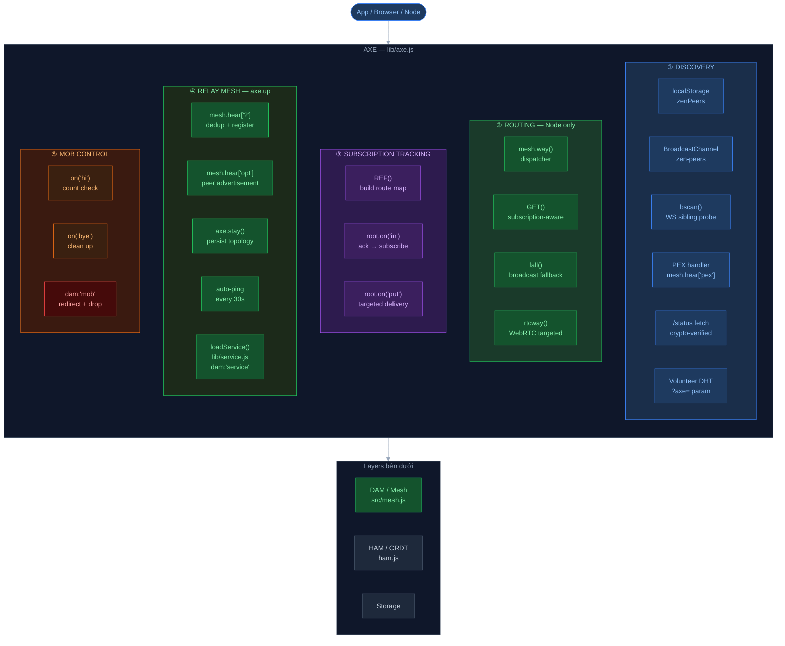

# AXE — Network Intelligence Layer

> **One-liner**: AXE = lớp trí tuệ mạng nằm trên DAM mesh, tự động phát hiện peer, route GET thông minh theo RTT, track subscription để chỉ forward PUT đúng nơi, và kiểm soát số lượng kết nối — không cần coordination server.

---

## Bức tranh tổng thể



---

## Tại sao AXE tồn tại?

DAM (mesh layer) chỉ biết một việc: **forward message đến tất cả peer đang kết nối**. Đó là đủ cho mạng nhỏ, nhưng khi scale lên hàng trăm relay và hàng nghìn client:

| Vấn đề không có AXE | Hậu quả |
|---|---|
| Mọi GET broadcast đến tất cả peer | O(n) bandwidth dù chỉ 1 peer có data |
| Mọi PUT broadcast đến tất cả peer | Peer không subscribe vẫn nhận — lãng phí |
| Relay không biết peer nào đang quan tâm soul nào | Không thể route thông minh |
| Browser không biết relay nào đang chạy | User phải cấu hình tay |
| Relay kết nối đến nhau theo cả hai chiều | Double connection, tốn kết nối |
| Peer kém nhất về latency được query đầu tiên | Latency cao không cần thiết |

AXE giải quyết tất cả những vấn đề trên với **zero coordination server** — mọi thứ tự thương lượng qua protocol.

---

## Hai execution mode

AXE phát hiện môi trường ngay khi khởi động qua `Zen.window`:

```
Zen.window truthy  →  Browser mode  (peer discovery + fallback)
typeof process !== "undefined"  →  Node.js mode  (full relay intelligence)
```

Nếu `opt.axe === false` → AXE không khởi động. Nếu env var `AXE=false` trên Node → relay mode tắt.

---

## ① Discovery — Browser Mode

Browser không có fixed address, không thể nhận inbound connection — nên AXE browser chỉ làm một việc: **tìm relay để kết nối**.

### Bootstrap sequence (6 nguồn, theo thứ tự ưu tiên)

```
1. localStorage.zenPeers     — peers từ session trước (JSON array)
2. window.location.origin    — same-origin relay (ví dụ app serve từ relay)
3. http://localhost:8420/zen  — relay đang chạy local (dev)
4. ?peers=url1,url2          — URL param tường minh
5. bscan(hostname)           — probe sibling domains (WS bypass CORS)
6. ?axe=dht_url  [+5s delay] — volunteer DHT nếu vẫn không connect được
```

Điểm đặc biệt: nguồn 5 và 6 chạy sau, không block các nguồn nhanh hơn.

### `adpbr(url)` — trung tâm của browser discovery

```js
function adpbr(url) {
  if (!url || !/^wss?:\/\//.test(url)) return;
  if (axe.fall[url]) return;             // đã biết rồi, skip
  axe.fall[url] = { url, id: url, retry: 0 };
  mesh.hi({ id: url, url: url, retry: 9 }); // connect
  lssv([url]);                            // save to localStorage
  bcast({ type: "peer", url: url });      // share qua BroadcastChannel
  try { bscan(new URL(url).hostname); } catch {} // scan siblings
}
```

Mỗi peer mới tìm được → ngay lập tức kích thêm 3 tác vụ: save, broadcast, scan. Thiết kế này làm cho discovery lan truyền như virus trong cùng browser session.

### `bscan(host)` — WebSocket sibling probe

WebSocket không bị CORS restrict → AXE tận dụng để probe sibling domains mà HTTP fetch không làm được.

```
zen1.akao.io  →  probe peer0, peer2, peer3, ..., peer100
               →  BCONC=5 concurrent WS, BMIDX=100 candidates, BMFND=10 found max
```

Mỗi probe là một WS connection thật: `onopen` → `adpbr()` → đóng ngay. Pattern:

```js
ws.onopen = function() {
  ws.close();          // không cần giữ connection — chỉ cần biết nó tồn tại
  adpbr(url);          // xử lý ở trên
};
ws.onerror = ws.onclose = function() { fly--; nxt(); }; // thử tiếp
```

Tại sao không dùng HTTP probe? Vì cross-origin HTTP request cần CORS header từ server. WS handshake thì không — đây là quirk hữu ích của browser security model.

### `/status` fetch — cryptographic peer list

Khi một relay connect thành công, AXE fetch endpoint `/status` của nó:

```
GET https://relay.akao.io/status
→ trả về signed JSON string (Zen.sign)
→ AXE gọi Zen.recover(str) để lấy public key
→ Zen.verify(str, pub) để xác minh chữ ký
→ parse status.peers → gọi adpbr() cho từng peer
```

Tại sao ký? Vì peer list từ relay có thể bị relay giả mạo. Khi có chữ ký, client biết đây là danh sách peer do **chủ relay** cung cấp, không phải relay bị compromise. Đây là trust-on-first-use model.

### BroadcastChannel — share qua tabs

```js
var bc = new BroadcastChannel("zen-peers");
// Khi tìm được peer mới:
bcast({ type: "peer", url: url });
// Tab khác nhận:
bc.onmessage = (e) => adpbr(e.data.url);
```

Mục đích: nếu tab A đã discover được relay X, tab B không cần discover lại từ đầu. Đặc biệt hữu ích khi bscan mất vài giây.

### `axe.fall` vs `axe.up`

| | `axe.fall` | `axe.up` |
|---|---|---|
| **Môi trường** | Browser | Node.js relay |
| **Nội dung** | Tất cả peer đã biết (URL → obj) | Cả inbound lẫn outbound (pid → peer) |
| **Key** | URL string | PID string |
| **Inbound** | N/A | Có — chỉ cho conflict detection + MOB |
| **Outbound** | N/A | Có — được axe.stay persist và auto-ping |
| **Mục đích** | Track để không kết nối lại; fallback khi disconnect | Relay mesh topology + conflict dedup |

---

## ② Routing — Node.js Relay Mode

### `mesh.way()` — dispatcher

```js
mesh.way = function(msg) {
  if (msg.get)           return GET(msg);    // smart routing
  if (msg.put)           return fall(msg);   // broadcast
  if (msg.dam === "rtc") return rtcway(msg); // targeted
  fall(msg);                                  // everything else: broadcast
};
```

`mesh.way` là điểm AXE hook vào DAM routing. Thay vì DAM broadcast mọi thứ, AXE intercept và quyết định: ai cần nhận message này?

### `GET()` — subscription-aware routing

```
GET đến AXE relay
  → REF(msg): extract soul/has, tạo/update route map và sub map
  → GET.turn(msg, ref.route, 0): hỏi peer theo thứ tự RTT tăng dần
```

`REF(msg)` làm hai việc đồng thời:
1. Gắn `via` (người gửi GET) vào `ref._.route` của soul đó — "người này đang chờ data về soul này"
2. Ghi `via.sub` — soul nào + field nào peer đó đang subscribe

Đây là lý do tại sao khi PUT đến sau, AXE biết chính xác ai cần nhận.

### `GET.turn()` — RTT-sorted iterative querying

```
GET.turn(msg, route, turn)
  route != null  → hỏi peers trong subscription map (targeted)
  route == null  → hỏi tất cả peers (broadcast fallback)
```

**Thuật toán:**

```
1. Lấy danh sách peers (từ route hoặc opt.peers)
2. Sort theo RTT tăng dần (peer không có RTT → Infinity → cuối)
3. Khi broadcast: relay peers (có url) lên đầu
4. Gửi từng batch 3 peer qua setTimeout.each (yield mỗi 3 để không block)
5. Sau batch: set tag.lack timeout 25ms
6. Nếu reply hash (##) match → STOP (dedup)
7. Sau 25ms không có reply → GET.turn lại với turn offset tiếp theo
8. Hết route peers → fallback sang broadcast tất cả
```

Tại sao batch 3? Đây là heuristic cân bằng giữa "hỏi đủ để có khả năng ai đó có data" và "không flood network nếu peer đầu tiên đã có". Con số 3 không có cơ sở lý thuyết chặt, nhưng trong thực tế phần lớn relay mesh có ít hơn 10 upstream → 3 là đủ để cover một hop.

Tại sao 25ms timeout? Đủ để packet đi về trong intra-datacenter (< 1ms) và nhiều inter-region (< 20ms). Quá ngắn cho cross-continent nhưng đó là acceptable — query sẽ retry tự động.

### `rtcway()` — targeted WebRTC signaling

```js
function rtcway(msg) {
  var toPid = msg.ok.rtc.to;
  for (id in peers) {
    if (peers[id].pid === toPid && peers[id].wire) {
      mesh.say(msg, peers[id]); // found — unicast
      return;
    }
  }
  fall(msg); // not found locally — broadcast to relay peers
}
```

WebRTC cần signaling (offer/answer/ICE candidates). Message có `dam: "rtc"` phải đến đúng peer có `pid === toPid`. Nếu peer đó đang kết nối trực tiếp với relay này → unicast. Nếu không → broadcast lên relay mesh để relay khác xử lý.

---

## ③ Subscription Tracking

Đây là cơ chế **quan trọng nhất** của AXE — cho phép PUT routing có chọn lọc thay vì broadcast tất cả.

### Hai cấu trúc dữ liệu trung tâm

```
ref._.route: Map<pid → via>
    "Peer nào đang quan tâm soul này"
    Key = peer ID, Value = via object (có wire, có sub)

via.sub: Map<soul → Map<has → 1>>
    "Peer này đang subscribe soul nào, field nào"
    soul="" = subscribe cả node
    has="name" = chỉ subscribe field "name"
```

### Khi GET đến: `REF()` populate route

```js
// REF(msg) — line 322
via.id && ref._ && (ref._.route ||= new Map()).set(via.id, via);
(via.sub ||= new Map()).get(soul)?.set(has, 1)
  || via.sub.set(soul, new Map([[has, 1]]));
```

### Khi ACK (PUT reply) đến: `root.on("in")` confirm subscription

```js
root.on("in", function(msg) {
  if (msg["@"] && dup.s[msg["@"]]?.it?.get && msg.put) {
    // Đây là PUT reply cho một GET
    // SUBSCRIBE người hỏi (via) vào ref.route:
    via.id && (ref.route ||= new Map()).set(via.id, via);
    // BIDIRECTIONAL: subscribe người trả lời (replier) cũng:
    replierVia.id && (ref.route ||= new Map()).set(replierVia.id, replierVia);
  }
  to.next(msg);
});
```

Tại sao bidirectional subscribe? Vì nếu A hỏi B về soul X, rồi C sau đó PUT vào soul X, C muốn A biết (A đang subscribe) và cũng muốn B biết (B đang lưu data). Tuy nhiên comment trong code mark là "DO WE WANT THIS?" — đây là trade-off chưa kết luận.

### Khi PUT đến: `root.on("put")` route có chọn lọc

```
PUT(soul, has, val, state)
  → lookup ref._.route
  → với mỗi peer trong route:
      - peer.wire còn không? (còn connected?)
      - peer.sub có {soul → {has: 1}} hoặc {soul → {"": 1}} không?
      - Nếu có → batch vào peer.put
  → debounce 9ms (ref.skip): rapid writes cùng field → coalesce
  → sau 9ms: flush(peer) → gửi batch message
```

**ref.skip debounce** — tại sao 9ms?

```js
(ref.skip = { now: msg["#"], has: has }).to = setTimeout(function() {
  // flush đến route
}, 9);
```

Nếu 5 write đến `user.name` trong 9ms, chỉ write cuối cùng được gửi đến subscriber. Lý do: subscriber chỉ cần state cuối cùng, không cần intermediate state. HAM (CRDT) đảm bảo consistency dù có skip — node với state cao nhất sẽ win.

### `flush(peer)` — batch delivery

```js
function flush(peer) {
  var msg = {
    "#": peer.next,
    put: peer.put,
    ok: { "@": 3, "/": mesh.near }
  };
  peer.next = peer.put = peer.to = null;
  mesh.say(msg, peer);
}
```

`peer.put` tích lũy nhiều soul/field updates → gửi một lần. `peer.next` là message ID được track bởi `dup`, cho phép backtrack ACK khi message được split bởi AXE.

---

## ④ Relay Mesh — `axe.up`

`axe.up` là **topology map của relay mesh**: `{ pid → peer }` chứa **cả inbound lẫn outbound** connections.

> **Phân biệt quan trọng**: mọi peer sau handshake (`mesh.hear["?"]`) đều vào `axe.up`. Nhưng chỉ outbound (có `peer.url`) mới được `axe.stay` và auto-ping. Inbound chỉ lưu để phục vụ conflict detection và MOB eviction.

```js
// Line 554-558 trong axe.js:
axe.up[peer.pid] = peer;          // ALL peers vào axe.up
if (!peer.url) {
  // Inbound — stored for conflict detection only. No axe.stay, no ping.
  return;
}
axe.stay();  // chỉ outbound kích trigger persist
```

### Duplicate connection resolution

Khi hai relay A và B đều cố connect đến nhau (xảy ra khi cả hai bootstrap cùng lúc từ một peer list chung):

```
A kết nối đến B  →  B có inbound từ A (không có url)
B kết nối đến A  →  A có inbound từ B (không có url)
```

Cả hai cùng thấy conflict khi `mesh.hear["?"]` chạy. Nếu không resolve → có 2 connections giữa A-B, tốn tài nguyên, và khi một connection drop sẽ trigger reconnect không cần thiết.

**Thuật toán PID sort** (lines 524–539):

```
opt.pid > peer.pid  →  relay này có PID cao hơn
    → drop whichever has url (outbound)
    → keep whichever has no url (inbound)

opt.pid < peer.pid  →  relay này có PID thấp hơn
    → keep whichever has url (outbound)
    → drop whichever has no url (inbound)
```

Kết quả: **cả hai relay đều chọn giữ cùng một connection** mà không cần trao đổi thêm. PID là string sort deterministic — nếu A.pid > B.pid thì B.pid < A.pid, cả hai đồng thuận.

Tại sao không dùng timestamp? Vì clock sync không đảm bảo. Tại sao không dùng random tiebreak? Vì cả hai phải đưa ra quyết định giống nhau từ local state — random sẽ khác nhau.

Lưu ý quan trọng: **không copy `drop.url` sang `keep`**. Nếu copy, inbound peer (no url) sẽ bị ghi url → `axe.stay` save url đó → next restart tạo outbound self-connection loop.

### Tại sao inbound vào `axe.up` nhưng không persist?

```js
// 3 lý do chỉ outbound được axe.stay:
```

1. **Outbound = relay mình biết và chọn**: `axe.stay` lưu URL → restore sau restart. Inbound không có URL → không thể save.
2. **Tránh self-URL loop**: Nếu inbound được lưu URL (copied từ outbound) → `axe.stay` save URL đó → next restart tạo outbound đến chính mình → vòng lặp.
3. **Inbound là "ai đó connect đến mình"**: Relay kia sẽ tự kết nối lại sau restart — không cần mình phải lưu.

Inbound vẫn trong `axe.up` để:
- PID conflict detection (xem phần trên)
- MOB eviction: MOB filter `!p.url` → evict inbound trước outbound
- `axe.up` length check (99 cap tính cả inbound)

### `mesh.hear["opt"]` — peer advertisement

```js
mesh.hear["opt"] = function(msg, peer) {
  // Relay peer gửi url của relay khác mà nó biết
  var tmp = msg.opt.peers;
  // Normalize: wss→https, ws→http (tránh dual outbound)
  var normTmp = tmp.replace(/^wss:\/\//, 'https://').replace(/^ws:\/\//, 'http://');
  // Guard self-connection
  if (urlHost === opt.domain) return;
  // Cap tại 99 peers
  if (Object.keys(axe.up).length >= 99) return;
  mesh.hi({ id: normTmp, url: normTmp, retry: 9 });
};
```

Tại sao normalize `wss→https`? DAM track peers bằng URL làm key. Nếu cùng một relay được lưu cả `wss://x` và `https://x` → hai outbound connections đến cùng một host. Normalize đảm bảo dedup hoạt động.

### `axe.stay` — persist topology

```js
axe.stay = function() {
  clearTimeout(axe.stay.to);
  axe.stay.to = setTimeout(function() {
    // Collect urls từ axe.up, save vào root.stats.stay.axe.up
  }, 9000); // debounce 9s
};
```

Khi topology thay đổi (peer mới join `axe.up`), `axe.stay` được gọi, debounce 9s, rồi persist. Tại sao 9s? Avoid write storm khi nhiều peers connect cùng lúc.

Khi restart:
```js
setTimeout(function() {
  if (opt.super) return; // super relay dùng BOOT thay vì axe.stay
  // Load lại từ root.stats.stay.axe.up
  tmp.forEach(url => mesh.hear.opt({ opt: { peers: url } }));
}, 1000);
```

`opt.super` là flag cho relay chạy trong cluster mode — BOOT module handle reconnect, không cần `axe.stay` restore.

### Auto-ping

```js
if (mesh.ping) {
  mesh.ping(peer);                    // ping ngay khi connect
  var iv = setInterval(function() {
    if (!peer.wire) { clearInterval(iv); return; }
    mesh.ping(peer);
  }, 30000);                          // repeat mỗi 30s
  peer._pingIv = iv;
}
```

Tại sao ping ngay? Vì `peer.rtt = 0` khi mới connect → sort RTT sẽ cho nó vào cuối (Infinity). Ping ngay → có RTT real data → GET.turn sort đúng.

Tại sao 30s? Đủ để detect degraded connection (3 missed pings = 90s). Không quá thường để tránh overhead.

### `loadService()` — remote relay management

Sau 9ms khởi động, AXE load `lib/service.js` (Node.js only, lazy import):

```js
// axe.js line 644-646:
setTimeout(function() {
  loadService(root);  // import("./service.js")
}, 9);

// loadService() bỏ qua nếu là browser:
function loadService(root) {
  if (Zen.window || typeof process === "undefined") return;
  // ...
}
```

`lib/service.js` đăng ký handler `mesh.hear["service"]` — cho phép relay nhận lệnh qua DAM protocol:

| Command | Điều kiện | Hành động |
|---|---|---|
| `{ dam:"service", try:"update", pass, version }` | Cần `/etc/systemd/system/relay.service` + pass đúng | Chạy `script/install.sh`, exit process |

Password được đọc từ `~/.config/zen/pass`. Sau khi `install.sh` chạy xong (kéo code mới, restart), relay tự exit → systemd restart với code mới.

Đây là cơ chế cho `zen update` CLI và MCP `update` tool hoạt động từ xa — không cần SSH.

## ⑤ Mob Control

Khi relay quá tải (`mesh.near > opt.mob`), AXE redirect peer mới đến relay khác thay vì drop không lý do.

```js
root.on("hi", function(peer) {
  this.to.next(peer);
  if (peer.url) return; // chỉ check inbound
  var count = mesh.near;
  if (opt.mob >= count) return;

  // Collect inbound peers, sort theo RTT cao nhất trước
  var candidates = Object.keys(axe.up)
    .map(p => axe.up[p])
    .filter(p => !p.url)
    .sort((a, b) => (b.rtt || Infinity) - (a.rtt || Infinity));

  var toDrop = candidates[0] || peer;
  mesh.say({ dam: "mob", mob: count, peers: outboundPeers }, toDrop);
  setTimeout(() => mesh.bye(toDrop), 9);
});
```

**Tại sao drop peer có RTT cao nhất?** Peer có latency cao nhất đang contribute ít nhất cho trải nghiệm network. Drop nó trước minimizes quality impact của việc rebalance.

**`dam: "mob"` message** chứa `peers` (danh sách outbound relays của relay hiện tại) → peer bị redirect biết phải connect đến đâu tiếp theo.

**9ms delay trước `mesh.bye`**: cho message `mob` kịp gửi qua wire trước khi đóng connection.

Vấn đề đã biết (comment trong code):
```
// TODO: BUG!!! Infinite reconnection loop happens if not enough relays,
// or if some are missing. For instance, :8766 says to connect to :8767
// which then says to connect to :8766.
```
Khi relay mesh quá nhỏ, mob redirect có thể tạo loop. Chưa có giải pháp ổn định — hiện tại `opt.mob` default là 999999 (effectively off).

---

## `Object.Map` polyfill

```js
{
  var from = Array.from;
  Object.maps = function(o) { /* return array of keys */ };
  if (from) { return (Object.Map = Map); }
  // Fallback cho môi trường không có native Map
  (Object.Map = function() { this.s = {}; }).prototype = { set, get, delete };
}
```

**Tại sao cần polyfill?** AXE được viết để chạy trên cả IE11-era browsers (không có native `Map`). `Object.Map` là Map interface tối giản với backing store là plain object `this.s`. Code dùng `Object.Map` thay vì `Map` trực tiếp để abstract over cả hai.

**`Object.maps(o)`** là `Object.keys` nhưng hiểu cả `Map` và `Object.Map`. Note: lowercase `s` — không phải typo.

Khi native `Map` có sẵn (`Array.from` là proxy check nhanh): `Object.Map = Map` và `return` ra khỏi block. Từ đây `new Object.Map()` là `new Map()` thật sự.

---

## Data flow tổng thể

### GET flow qua AXE relay

```
Client A  →  GET soul/field
          →  DAM mesh.way(msg)
          →  AXE GET(msg)
                → REF(msg): ghi A vào route[soul], ghi soul/field vào A.sub
                → GET.turn(msg, ref.route, 0)
                    → sort peers by RTT
                    → hỏi batch 3 peer
                    → 25ms timeout → retry next batch
                    → route exhausted → fallback broadcast
          ←  PUT reply từ Peer B
          →  root.on("in")
                → đánh dấu A subscribe soul/field (permanent)
                → đánh dấu B subscribe (bidirectional)
          →  forward reply về A
```

### PUT flow qua AXE relay

```
Client B  →  PUT soul/field/val
          →  DAM mesh.way(msg): fall(msg) → broadcast đến tất cả peers
          →  root.on("put") [chạy song song]
                → lookup ref._.route[soul]
                → với mỗi peer trong route:
                    → check peer.sub[soul][field]
                    → nếu match: batch vào peer.put
                → debounce 9ms (ref.skip)
                → flush(peer): gửi batch đến đúng peers
```

Lưu ý: `fall(msg)` vẫn broadcast PUT đến tất cả. AXE `root.on("put")` chạy **thêm** một lần targeted delivery, không thay thế broadcast. Đây là redundancy có chủ ý: đảm bảo relay mesh đồng bộ dù subscription map chưa đầy đủ.

---

## Điểm mạnh

| # | Điểm mạnh | Chi tiết |
|---|---|---|
| 1 | **Zero config discovery** | Browser tự tìm relay qua localStorage, same-origin, WS scan, BroadcastChannel |
| 2 | **RTT-aware routing** | GET hỏi peer nhanh nhất trước — giảm latency có data path |
| 3 | **Targeted PUT delivery** | Chỉ forward đến peer đã subscribe — giảm bandwidth O(n) → O(subscribers) |
| 4 | **Cryptographic peer list** | `/status` endpoint có chữ ký → peer list không thể bị inject |
| 5 | **Symmetric dedup** | PID sort → cả hai relay đồng thuận drop connection nào mà không cần negotiate |
| 6 | **Mob rebalancing** | Redirect thay vì drop → peer bị reject vẫn biết đi đâu tiếp |
| 7 | **RTT-based mob pruning** | Drop peer latency cao nhất trước → minimize quality impact |
| 8 | **Topology persistence** | `axe.stay` → relay mesh restore nhanh sau restart |
| 9 | **Remote management** | `lib/service.js` cho phép `zen update` / MCP update relay từ xa qua DAM, không cần SSH |

---

## Điểm yếu

| # | Điểm yếu | Tác động |
|---|---|---|
| 1 | **Mob loop bug** | Nếu relay mesh < 2 relays, mob redirect tạo vòng lặp vô tận |
| 2 | **Bidirectional subscribe** | Replier bị subscribe dù có thể không muốn — tốn bandwidth |
| 3 | **25ms timeout heuristic** | Cross-continent RTT > 25ms → retry nhiều lần không cần thiết |
| 4 | **Broadcast + targeted redundancy** | PUT vẫn broadcast tất cả qua `fall()` — targeted chỉ là bonus, không thay thế |
| 5 | **99 peer cap hardcoded** | `mesh.hear["opt"]` dừng ở 99 — "TEMPORARILY UNTIL BENCHMARKED!" từ comment |
| 6 | **bscan CORS workaround** | Dựa vào quirk WS bypass CORS — có thể bị browser policy thay đổi |
| 7 | **Volunteer DHT trust** | `?axe=` URL param → fetch peer list từ arbitrary URL, chỉ filter regex `wss?://` |
| 8 | **Inbound không được restore sau restart** | `axe.stay` chỉ persist outbound URLs. Nếu tất cả outbound peers die, relay bị cô lập cho đến khi có inbound kết nối lại |

---

## Quan hệ với các layer khác

```
ZEN.gun() / ZEN()
    │
    ├── Zen.on("opt", start)     ← AXE hook vào đây
    │       │
    │       └── opt.mesh = Zen.Mesh(root)  ← DAM được tạo ở đây, AXE dùng
    │
    ├── mesh.way = function()    ← AXE override DAM routing
    │
    ├── mesh.hear["?"]           ← AXE override DAM handshake handler
    ├── mesh.hear["opt"]         ← AXE thêm peer advertisement handler
    ├── mesh.hear["pex"]         ← AXE thêm PEX handler (browser)
    ├── mesh.hear["mob"]         ← DAM handle mob message từ relay (browser)
    ├── mesh.hear["service"]     ← lib/service.js: remote update via DAM (Node.js, systemd)
    │
    ├── root.on("hi")            ← AXE intercept connect event (browser + mob)
    ├── root.on("bye")           ← AXE intercept disconnect event
    ├── root.on("in")            ← AXE intercept inbound message (subscription)
    └── root.on("create")        ← AXE intercept graph create (PUT routing)
              └── root.on("put") ← AXE intercept each put (targeted delivery)
```

AXE không modify HAM hay storage — nó chỉ control **who receives what** ở tầng network, còn HAM tiếp tục làm conflict resolution như bình thường khi data đến.

---

## Mental Model tổng kết

```
AXE = Hai bộ não cho hai môi trường

BROWSER:
  "Tôi không có địa chỉ cố định.
   Hãy để tôi tìm relay bằng mọi cách có thể.
   Khi tìm được, share với tất cả tab khác.
   Khi mất kết nối, thử peer tiếp theo."

NODE RELAY:
  "Tôi là hub.
   GET đến tôi → tôi hỏi đúng người, theo thứ tự RTT.
   PUT đến tôi → tôi gửi đúng người đang chờ, không broadcast vô tội vạ.
   Relay mới kết nối → tôi negotiate giữ một connection thôi.
   Peer quá nhiều → tôi redirect peer tệ nhất đi chỗ khác.
   Ai muốn update tôi từ xa → gửi dam:'service' + password là xong."
```

**Cách nhớ 5 layer của AXE:**

1. **Discovery** = tìm relay bằng mọi cách — localStorage, scan, PEX, status, DHT → [Browser Mode](#-discovery--browser-mode)
2. **Routing** = `mesh.way` phân loại GET/PUT/RTC → [Node.js Relay Mode](#-routing--nodejs-relay-mode)
3. **Subscription** = track ai cần soul nào → PUT đến đúng người → [Subscription Tracking](#-subscription-tracking)
4. **Relay Mesh** = `axe.up`, PID sort dedup, stay persist → [Relay Mesh](#-relay-mesh--axeup)
5. **Mob** = redirect thay vì drop khi quá tải → [Mob Control](#-mob-control)

Tất cả 5 layer chạy **trong cùng một process**, **không cần coordination server**, **không cần consensus protocol**.
