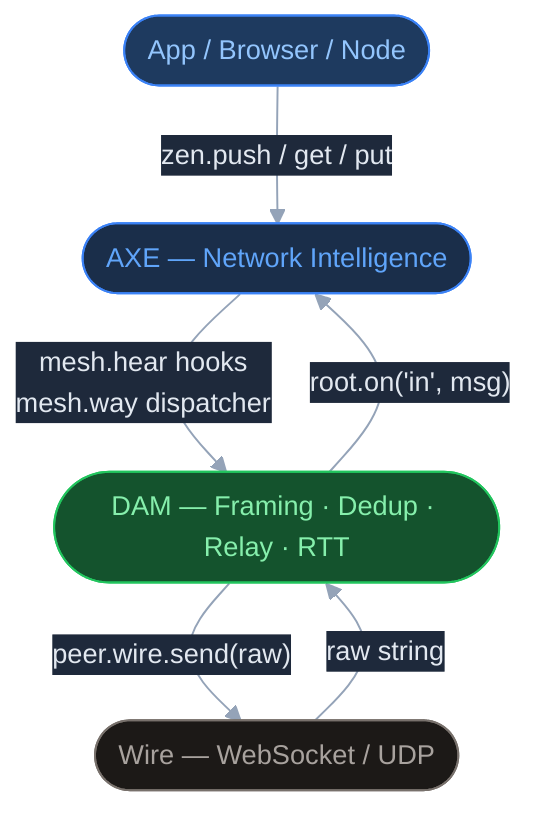
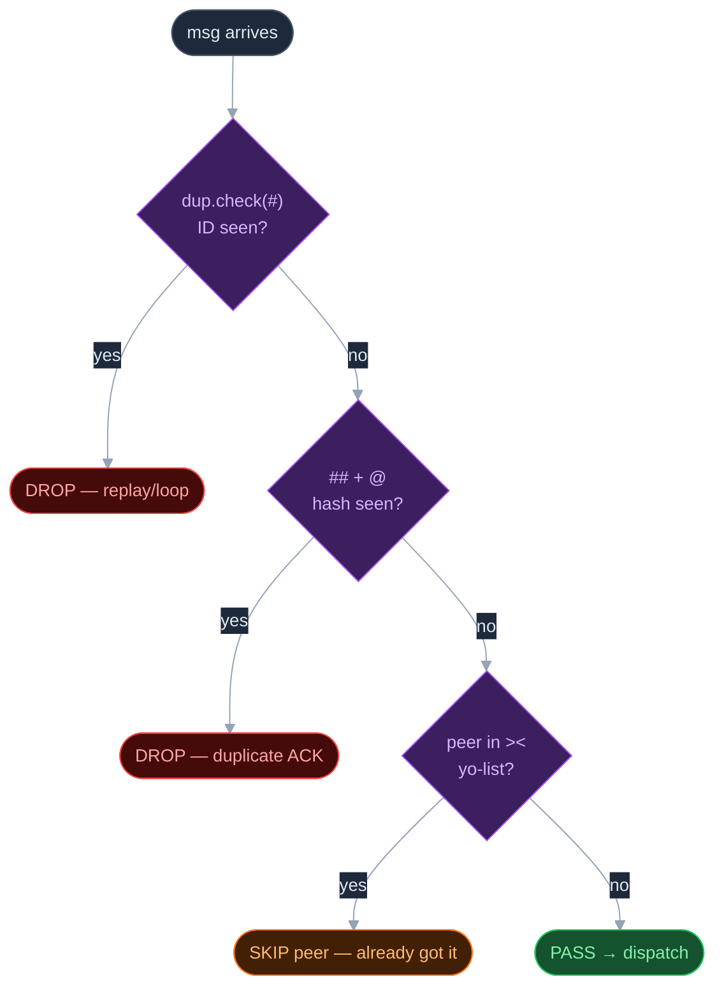
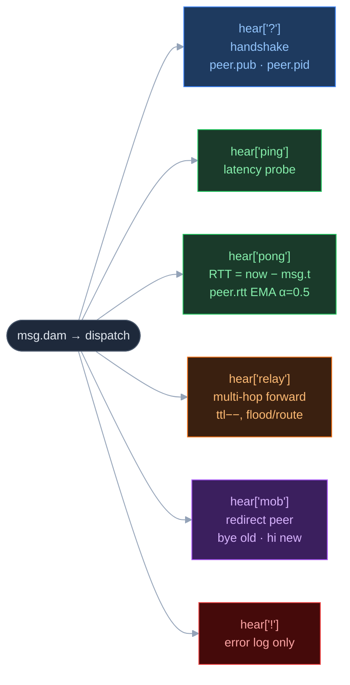
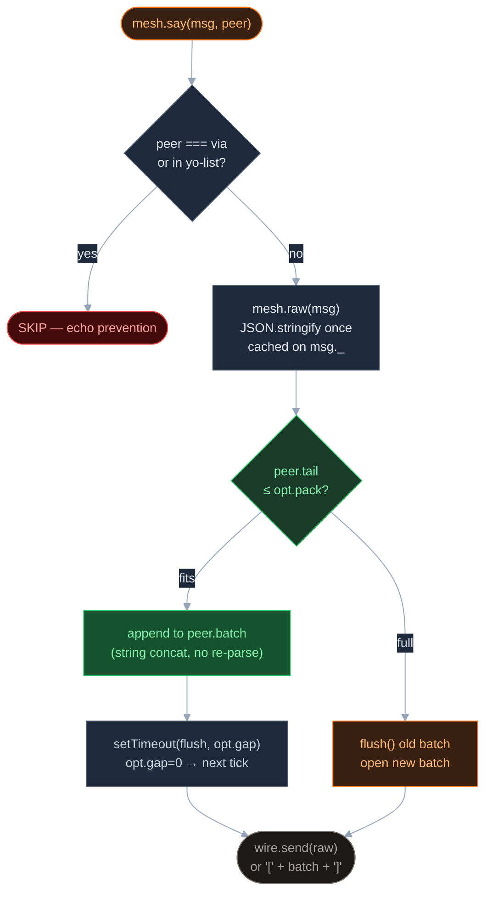
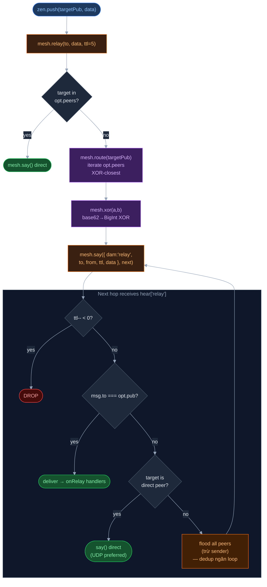
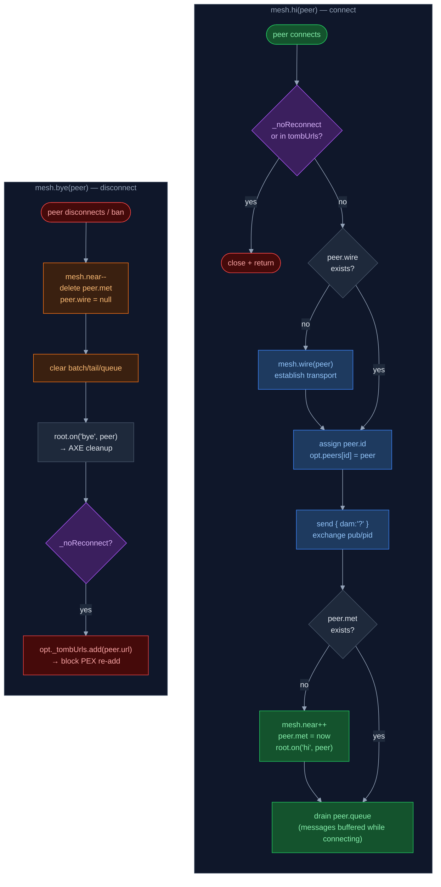

# DAM — Directed Acyclic Mesh

> **One-liner**: DAM = lớp truyền tin thô nằm ngay trên wire (WebSocket/UDP), đảm nhận parse frame, dedup message, batch delivery, ping/pong RTT, và relay multi-hop theo XOR distance — không biết gì về graph hay policy.

---

## A. Stack vị trí — DAM trong hệ thống



WebSocket và UDP chỉ biết gửi byte. Graph layer (HAM/CRDT) chỉ biết hợp nhất state. Ở giữa cần một lớp làm những việc không thuộc về ai:

| Vấn đề không có DAM                           | Hậu quả                                     |
| --------------------------------------------- | ------------------------------------------- |
| Peer gửi message nhiều lần (retry, multicast) | Graph xử lý cùng một write nhiều lần        |
| Nhiều message nhỏ gửi liên tiếp               | RTT tăng, throughput giảm (TCP Nagle ngược) |
| Không biết peer nào còn sống                  | Gửi mù, mất message silently                |
| Muốn gửi ephemeral data (không persistent)    | Phải dùng graph — sai mục đích              |
| Không biết latency peer nào tốt hơn           | AXE không thể route thông minh              |

DAM giải quyết tất cả với **zero application logic** — nó không biết user là ai, soul là gì, hay policy nào đang áp dụng.

DAM không phụ thuộc vào AXE — AXE hook vào DAM từ bên trên qua `mesh.hear[type]` và `mesh.way`. Nếu tắt AXE, DAM vẫn hoạt động với broadcast đơn giản.

| Layer                    | Quan hệ         | Chi tiết                                                                                |
| ------------------------ | --------------- | --------------------------------------------------------------------------------------- |
| **Wire (WebSocket/UDP)** | Bên dưới        | Wire gọi `mesh.hear(raw, peer)` khi data đến; DAM gọi `peer.wire.send(raw)` để gửi      |
| **HAM / Graph**          | Bên trên        | Message không có `dam` field → `root.on("in", msg)` → HAM xử lý put/get/CRDT            |
| **AXE**                  | Overlay         | AXE override `mesh.hear[type]`, inject `mesh.way` dispatcher, gọi `mesh.ping()` định kỳ |
| **PEN**                  | Không liên quan | PEN validate policy sau khi message lên graph; DAM không biết PEN tồn tại               |
| **DUP**                  | Bên trong       | `src/dup.js` là module riêng, DAM dùng qua `root.dup`                                   |
| **root.on events**       | Pub/sub         | DAM emit `"hi"`, `"bye"` events; AXE và app listen; DAM listen `"create"`, `"out"`      |

---

## B. Data flow tổng quan — Receive → Dispatch → Send

```mermaid
%%{init: {'theme': 'base', 'themeVariables': {
  'fontSize': '14px',
  'primaryColor': '#1e293b',
  'primaryTextColor': '#e2e8f0',
  'primaryBorderColor': '#475569',
  'lineColor': '#94a3b8',
  'secondaryColor': '#0f172a',
  'tertiaryColor': '#1e293b',
  'background': '#0f172a',
  'mainBkg': '#1e293b',
  'nodeBorder': '#475569',
  'clusterBkg': '#0f172a',
  'clusterBorder': '#334155',
  'titleColor': '#94a3b8',
  'edgeLabelBackground': '#1e293b'
}}}%%
graph LR
    WIRE(["Wire"])

    subgraph RECV["① RECEIVE"]
        direction TB
        HEAR["mesh.hear(raw, peer)"]
        BATCH_IN["batch parser"]
        ONE["hear.one()"]
    end

    subgraph DEDUP["② DEDUP"]
        direction TB
        DUP["dup.check #id"]
        HASH_D["hash dedup ##"]
        YO["yo-list ><"]
    end

    subgraph DISPATCH["③ DISPATCH"]
        direction TB
        PROTO["msg.dam → protocol handler"]
        GRAPH["graph msg → root.on('in')"]
    end

    subgraph SEND["④ SEND"]
        direction TB
        SAY["mesh.say()"]
        BATCH_OUT["peer.batch buffer"]
        FLUSH["flush → wire.send()"]
    end

    WIRE -->|raw| HEAR
    HEAR --> BATCH_IN & ONE
    BATCH_IN -->|"puff N/tick"| ONE
    ONE --> DEDUP
    DEDUP -->|pass| DISPATCH
    DISPATCH --> PROTO & GRAPH
    PROTO --> SAY
    GRAPH --> SAY
    SAY --> BATCH_OUT --> FLUSH --> WIRE

    style RECV fill:#1e3a5f,stroke:#3b82f6,color:#93c5fd
    style DEDUP fill:#3b1f5e,stroke:#a855f7,color:#d8b4fe
    style DISPATCH fill:#1a3a2a,stroke:#22c55e,color:#86efac
    style SEND fill:#3a2010,stroke:#f97316,color:#fdba74
```



Mọi byte đến từ wire đều đi qua `hear`. Hàm này làm 3 việc theo thứ tự:

```text
raw arrives
    │
    ├─ raw[0] === '['  →  parse batch JSON array  →  hear.one() × N (puffed)
    │
    ├─ raw[0] === '{'  →  parse single JSON object  →  hear.one()
    │
    └─ raw["#"] exists (already object)  →  hear.one() trực tiếp
```

### `puff` — cooperative multitasking

Khi batch lớn đến (ví dụ 500 message), DAM không xử lý tất cả cùng một lúc. Nó xử lý `opt.puff` (mặc định 9) message rồi yield qua `setTimeout(go, 0)` — cho event loop thở:

```js
var P = opt.puff; // default 9
function go() {
  var i = 0, m;
  while (i < P && (m = msg[i++])) {
    mesh.hear(m, peer);
  }
  msg = msg.slice(i);
  flush(peer);     // force-send batched ACKs sau mỗi chunk
  if (!msg.length) return;
  puff(go, 0);     // yield rồi tiếp tục
}
```

### `hear.one(msg, peer)` — xử lý một message

```text
hear.one
    │
    ├─ msg["#"] không có  →  tạo random ID
    │
    ├─ dup.check(id)  →  true  →  drop (đã thấy)
    │
    ├─ ## hash dedup  →  drop nếu ACK cùng hash
    │
    ├─ msg._ = function(){}  ← metadata carrier (invisible to JSON.stringify)
    │   └─ msg._.via = peer  ← ai gửi message này
    │
    ├─ "><" parsing  →  msg._.yo = {peer1: 1, peer2: 1}  ← skip list
    │
    ├─ msg.dam  →  dispatch tới protocol handler
    │   └─ dup_track(id)  ← track với via = peer
    │
    └─ graph message  →  root.on("in", msg)  ← lên HAM layer
        └─ dup_track(id)
```

### `root.on("out")` hook

```js
root.on("create", function(root) {
  root.on("out", mesh.say);  // graph layer gọi mesh.say để gửi
});
```

Khi HAM muốn gửi message ra ngoài, nó emit `"out"` → DAM intercept qua `mesh.say`.

### `on("hi")` — re-subscribe sau reconnect

Khi peer mới kết nối, DAM emit `"hi"`. Handler trong `mesh.js` tự động re-send tất cả active GET subscriptions đến peer đó:

```js
root.on("hi", function(peer) {
  var souls = Object.keys(root.next || ""); // tất cả soul đang subscribe
  souls.forEach(soul => {
    mesh.say({ get: { "#": soul } }, peer);
  });
});
```

Đây là lý do app không cần handle reconnect thủ công — data sẽ tự sync.

### Stats tích hợp

```js
hear.c  // số message đã hear
hear.d  // bytes đã hear
mesh.say.c  // số message đã say
mesh.say.d  // bytes đã say
```

Dùng `console.STAT` để bật profiling chi tiết.

---

## C. Dedup Engine — 3 lớp lọc trùng



DAM dùng `Dup` — một Map-based TTL cache — để track message ID đã thấy:

```js
opt = { max: 999, age: 9000 }  // max entries, TTL 9 giây

dup.check(id)   // true nếu đã thấy → drop message
dup.track(id)   // thêm vào cache, return entry { was, via, it }
dup.drop()      // evict entries cũ hơn opt.age
```

**Eviction strategy:** Map là insertion-ordered — khi đầy (`s.size >= max`), xóa entry đầu tiên (oldest). O(1) cho mọi operation.

| Lớp            | Key                    | Mục đích                              |
| -------------- | ---------------------- | ------------------------------------- |
| **ID dedup**   | `msg["#"]`             | Chặn replay và loop broadcast         |
| **Hash dedup** | `msg["@"] + msg["##"]` | Dedup ACK cùng nội dung từ nhiều path |
| **Yo-list**    | `msg["><"]`            | Skip re-send đến peer đã nhận         |

**Yo-list (`"><`):** Khi gửi broadcast, DAM thêm `"><": "peer1url,peer2url"` vào message. Receiver parse thành `msg._.yo` và không forward đến các peer đó. Giới hạn 99 chars để tránh overhead.

---

## D. Protocol Handlers — các message type của DAM



### `?` — Handshake (peer discovery)

```js
// Initiator gửi:
{ dam: "?", pid: "abc123xyz", pub: "45charBase62...", udp?: 5678, udpToken?: "..." }

// Responder reply:
{ dam: "?", pid: "...", pub: "...", "@": msg["#"],  udp?: ..., udpToken?: ... }
```

Flow:

```text
mesh.hi(peer)
    │
    ├─ peer chưa có id  →  gửi handshake ?
    │
    └─ hear['?'] nhận:
        ├─ lưu peer.pid, peer.pub, peer.udpPort, peer.udpToken
        └─ nếu không phải reply (@) → gửi handshake ngược lại
```

Sau handshake, hai peer biết `pub` của nhau → có thể dùng XOR routing.

**Self-send prevention:** Sau khi gửi handshake, `dup.s.delete(peer.last)` — xóa ID của message vừa gửi khỏi dup cache. Nếu không xóa, khi peer echo lại, DAM sẽ drop vì nghĩ đã thấy.

### `ping` / `pong` — RTT measurement

```js
// Sender (thường là AXE mỗi 30s):
{ dam: "ping", t: +new Date() }

// Receiver:
{ dam: "pong", t: msg.t, "@": msg["#"] }

// Sender nhận pong:
var rtt = +new Date() - msg.t;
peer.rtt = peer.rtt !== undefined
  ? (peer.rtt + rtt) / 2   // exponential moving average (α = 0.5)
  : rtt;
```

`peer.rtt` là giá trị AXE dùng để ưu tiên GET routing — peer RTT thấp nhất được query đầu tiên.

### `mob` — Mobility / redirect

```js
{ dam: "mob", peers: { "wss://relay2.example.com": { url: "..." }, ... } }
```

Khi relay quá tải, AXE gửi `mob` để redirect peer mới đến relay khác. Relay cơ bản (không có AXE) chỉ pick một peer ngẫu nhiên, gọi `mesh.bye(current)` rồi `mesh.hi(new)`. AXE override handler này với logic thông minh hơn.

### `!` — Error

```js
{ dam: "!", err: "Message too big!" }
```

Log lỗi, không xử lý thêm.

---

## E. Send Pipeline — Batch & Flush



`say` là hàm phức tạp nhất trong DAM — nó xử lý nhiều trường hợp:

```
mesh.say(msg, peer)
    │
    ├─ msg["#"] không có  →  tạo random ID
    │
    ├─ msg chưa có raw string  →  mesh.raw(msg) serialize JSON  →  retry say
    │
    ├─ peer không xác định + msg có "@" (ack)
    │   └─ lookup via dup.s.get(ack).via  ← ai gửi request gốc?
    │
    ├─ peer là object (map của peers)  →  broadcast loop
    │   └─ puff: gửi P peers mỗi tick, yield, tiếp tục
    │
    ├─ peer.id === peer.last  →  skip (vừa gửi xong)
    ├─ peer === msg._.via  →  skip (đừng echo lại sender)
    ├─ peer.pid / url trong msg._.yo  →  skip (đã nhận rồi)
    │
    └─ Batch logic:
        ├─ peer.batch đang mở + raw đủ nhỏ  →  append vào batch buffer
        └─ peer.batch đầy hoặc chưa mở:
            ├─ flush() batch cũ
            ├─ peer.batch = "["  ← mở batch mới
            ├─ setTimeout(flush, opt.gap)  ← close sau opt.gap ms
            └─ send(raw, peer)  ← gửi ngay message này
```

### Batch mechanism

```
opt.pack = opt.max * 0.0001  // threshold kích thước batch

Khi peer.tail <= opt.pack:
    peer.batch += "," + raw   // append string
    peer.tail += raw.length   // track size

Khi vượt threshold hoặc timer fired:
    send("[" + batch + "]", peer)   // gửi JSON array
    peer.batch = peer.tail = null
```

Batch hoạt động ở mức **string concatenation** — không parse/stringify lại — cực kỳ nhanh.

### `mesh.raw(msg)` — JSON serialization với cache

```js
meta.raw = JSON.stringify(msg)  // cached sau lần đầu
```

Một message chỉ serialize một lần dù gửi đến N peers. Ngoại lệ: message lớn (`>= 99*999` bytes) không cache để tránh OOM.

**`><` field được inject tại đây** — trước khi serialize, DAM thêm `"><": "peer1,peer2,..."` (tối đa 6 peers, skip nếu chỉ 1 peer).

### Sizing & thresholds

```js
opt.gap  = 0         // batch timer (ms) — 0 = flush trong cùng tick
opt.max  = memory * 0.3  // max message size (bytes), mặc định ~300MB * 0.3
opt.pack = opt.max * 0.0001  // batch size threshold
opt.puff = 9         // messages xử lý mỗi tick trước khi yield
dup.max  = 999       // max entries trong dedup cache
dup.age  = 9000      // TTL dedup entries (ms)
```

`setTimeout(fn, 0)` trong browsers thực ra delay ~4ms (HTML spec minimum). Với `gap=0`, batch timer vẫn tạo một small window để multiple messages được gom lại trong cùng một JS event loop tick. Nếu cần ultra-low latency, set `opt.gap = -1` để disable batching hoàn toàn.

### JSON blocking detection

```js
json.sucks = function(d) {
  if (d > 99) {  // JSON parse mất >99ms
    console.log("Warning: JSON blocking CPU detected...");
  }
};
```

Nếu JSON parse chặn event loop, recommend dùng `zen/lib/yson.js` (YSON — chunked JSON parser chạy async).

---

## F. Relay Engine — XOR DHT routing



DAM implement một Kademlia-inspired routing để gửi ephemeral message đến peer không trực tiếp kết nối.

### XOR Distance

Mỗi peer được định danh bằng `pub` — 45-char base62-encoded secp256k1 public key (33 bytes compressed). XOR distance giữa hai pub key:

```js
mesh.xor(a, b)
    │
    ├─ decode base62 → BigInt (b62bi)
    └─ return na ^ nb   // BigInt XOR
```

Base62 → BigInt cần hàm riêng vì `base62.b62ToBI` enforce đúng 44 chars (44-char pub keys cũ), nhưng pub keys hiện tại là 45 chars.

### Routing table

Không có k-bucket. Routing table chính là `opt.peers` — map của tất cả peer đang kết nối:

```js
mesh.route(targetPub, skip)
    │
    ├─ iterate opt.peers
    ├─ skip peers không có pub, không có wire, hoặc === skip
    ├─ tính XOR distance đến targetPub
    └─ return peer có distance nhỏ nhất
```

### Tại sao flood thay vì greedy XOR?

Single-hop XOR routing thất bại khi routing table không đầy đủ — ví dụ inbound-only peer (browser) không xuất hiện trong DHT k-bucket của intermediate relay. Flooding với TTL đảm bảo delivery; dedup bằng `msg["#"]` giữ nguyên qua các hop ngăn vòng lặp thực sự.

### `mesh.onRelay(fn)` — subscribe

```js
var off = mesh.onRelay(function({ from, data }) {
  console.log("got relay from", from, data);
});

off(); // unsubscribe
```

---

## G. Connection Lifecycle — hi / bye / tombstone



### `mesh.hi(peer)` — register peer

```
mesh.hi(peer)
    │
    ├─ peer.wire chưa có  →  mesh.wire(peer)  ← establish connection
    │
    ├─ AXE tombstone check:
    │   └─ peer._noReconnect hoặc URL trong opt._tombUrls  →  close + return
    │
    ├─ peer.id chưa có:
    │   ├─ assign id = url || random(9)
    │   ├─ opt.peers[id] = peer
    │   └─ gửi handshake ?
    │
    ├─ peer.met chưa có (lần đầu):
    │   ├─ mesh.near++
    │   ├─ peer.met = now
    │   └─ root.on("hi", peer)  ← trigger AXE, app listeners
    │
    └─ drain peer.queue  ← messages queued trước khi wire ready
```

`mesh.near` = số peer hiện tại đang kết nối.

### `mesh.bye(peer)` — disconnect peer

```
mesh.bye(peer)
    │
    ├─ mesh.near--
    ├─ delete peer.met
    ├─ peer.wire = null  ← mesh.route() sẽ skip peer này
    ├─ peer.batch/tail/queue = null  ← clear buffers
    ├─ root.on("bye", peer)  ← AXE cleanup
    │
    └─ nếu peer._noReconnect:
        ├─ peer._noReconnect = true  (tombstone)
        └─ opt._tombUrls.add(peer.url)  ← ngăn PEX re-add
```

**Tombstone pattern:** Khi AXE mark peer là bad (ban), `_noReconnect = true` được set. `mesh.bye` thêm URL vào `opt._tombUrls`. Khi AXE PEX share URL này với peer khác và họ cố kết nối, `mesh.hi` sẽ reject ngay lập tức.

---

## Tham khảo

### Peer object anatomy

```js
{
  id: string,           // key trong opt.peers, thường = URL hoặc random(9)
  url?: string,         // "wss://relay.example.com/zen"
  pid?: string,         // 9-char process ID (từ handshake ?)
  pub?: string,         // 45-char base62 secp256k1 pub key
  wire?: object,        // { send(raw) } — WebSocket hoặc UDP adapter
  met?: number,         // timestamp lúc kết nối lần đầu
  rtt?: number,         // rolling-average RTT (ms), α=0.5
  batch?: string,       // outgoing batch buffer ("["...)
  tail?: number,        // bytes trong batch hiện tại
  queue?: string[],     // messages queued khi wire chưa ready
  last?: string,        // msg["#"] vừa gửi (skip duplicate send)
  SI?: string,          // msg["#"] vừa nhận (stats)
  SH?: number,          // timestamp nhận message cuối (stats)
  udpPort?: number,     // UDP port peer đang listen (từ handshake)
  udpToken?: string,    // token cần gửi kèm UDP packet đến peer này
  udpSay?: function,    // UDP send fn nếu có UDP transport
  _noReconnect?: bool,  // tombstone flag — không reconnect/accept
  _isOutbound?: bool,   // true nếu chúng ta initiate connection
}
```

### Message envelope

```js
{
  "#": "9charRand",     // message ID — dedup key, required
  "@"?: "9charRand",    // reply-to ID — ack routing
  "dam"?: "type",       // nếu có → DAM protocol handler, không lên graph
  "##"?: "hashStr",     // content hash — ACK dedup
  "><"?: "url1,url2",   // yo-list — skip re-send (max 99 chars)
  "_"?: function,       // metadata carrier (non-enumerable, không serialize)
  // graph fields:
  get?: { "#": soul, ".": key },
  put?: { [soul]: node },
  // relay fields:
  to?: "45charPub",
  from?: "45charPub",
  ttl?: number,
  data?: any,
}
```

`msg._` là một function (không phải plain object) để `Object.plain()` return false — đảm bảo metadata không bị serialize hay truyền qua wire.

### Điểm mạnh và điểm yếu

| Điểm mạnh             |                                                                         |
| --------------------- | ----------------------------------------------------------------------- |
| **Zero coordination** | Routing hoạt động mà không cần central server hay routing table đồng bộ |
| **Ephemeral relay**   | `zen.push()` gửi data không cần persist vào graph                       |
| **Tự heal**           | Khi peer reconnect, `on("hi")` tự re-subscribe                          |
| **AXE-agnostic**      | Hoạt động cơ bản mà không cần AXE — AXE chỉ optimize                    |
| **Batch hiệu quả**    | String concatenation thay vì serialize lại                              |

| Điểm yếu / trade-off                |                                                                        |
| ----------------------------------- | ---------------------------------------------------------------------- |
| **Flooding fallback**               | Relay fallback flood tất cả peer — tốn bandwidth khi mesh lớn          |
| **Routing table = connected peers** | Không có global view → XOR routing chỉ greedy trên local knowledge     |
| **Dedup TTL cố định 9s**            | Message delay >9s sẽ không bị dedup — có thể xảy ra với satellite link |
| **Yo-list 99 chars**                | Chỉ track 6 peers trong yo-list — broadcast lớn vẫn có duplicate       |
| **No prioritization**               | Tất cả message xử lý theo FIFO — không có QoS hay priority queue       |

### Files và entry points

| File                                       | Vai trò              | Hàm quan trọng                                                              |
| ------------------------------------------ | -------------------- | --------------------------------------------------------------------------- |
| [src/mesh.js](../../src/mesh.js)           | DAM implementation   | `Mesh()`, `hear()`, `say()`, `relay()`, `route()`, `xor()`, `hi()`, `bye()` |
| [src/dup.js](../../src/dup.js)             | Dedup cache          | `dup.check()`, `dup.track()`, `dup.drop()`                                  |
| [src/websocket.js](../../src/websocket.js) | Wire layer           | Gọi `mesh.hear(raw, peer)` khi data đến                                     |
| [src/root.js](../../src/root.js)           | App core             | Emit `"out"` → DAM; receive `"in"` từ DAM                                   |
| [src/graph.js](../../src/graph.js)         | Graph API            | `zen.push()` → `mesh.relay()`                                               |
| [lib/axe.js](../../lib/axe.js)             | Network intelligence | Override handlers, inject `mesh.way`                                        |
