# DHT — Kademlia k-bucket overlay

> **One-liner**: DHT = optional layer chạy trên relay/server nodes, bổ sung k-bucket Kademlia cho `mesh.route()` — thay thế greedy scan bằng globally-aware XOR routing mà không thay đổi DAM protocol.

`dht.js` được load bởi `lib/server.js` **sau** `axe.js`. Browser nodes tự động bị skip (`typeof process === "undefined"`). Disable bằng `opt.dht = false`.

| Node type | `mesh.route()` behavior |
| --- | --- |
| **Browser** | Greedy scan `opt.peers` — connected peers only |
| **Server/relay** | k-bucket first → fallback greedy scan (khi `dht.js` load) |

---

## K-bucket structure

```mermaid
%%{init: {'theme': 'base', 'themeVariables': {
  'fontSize': '14px',
  'primaryColor': '#1e293b',
  'primaryTextColor': '#e2e8f0',
  'primaryBorderColor': '#475569',
  'lineColor': '#94a3b8',
  'secondaryColor': '#0f172a',
  'tertiaryColor': '#1e293b',
  'background': '#0f172a',
  'mainBkg': '#1e293b',
  'nodeBorder': '#475569',
  'clusterBkg': '#0f172a',
  'clusterBorder': '#334155',
  'titleColor': '#94a3b8',
  'edgeLabelBackground': '#1e293b'
}}}%%
graph LR
    PUB(["peer.pub\n45-char base62"])
    XOR["mesh.xor(self, peer)\nBigInt XOR distance"]
    BITLEN["bitlen(d) - 1\nlog2 floor"]
    IDX["bucket index\n0 … 511"]

    subgraph BUCKET["buckets[idx] — max K=20 entries"]
        direction LR
        HEAD["head — oldest"]
        TAIL["tail — most-recently-seen"]
    end

    FULL{"bucket full?"}
    HEAD_LIVE{"head peer\nstill connected?"}
    EVICT["evict head\nappend new"]
    DROP["drop candidate\n(prefer stable)"]
    APPEND["append to tail"]

    PUB --> XOR --> BITLEN --> IDX --> BUCKET
    BUCKET --> FULL
    FULL -->|no| APPEND
    FULL -->|yes| HEAD_LIVE
    HEAD_LIVE -->|no| EVICT
    HEAD_LIVE -->|yes| DROP

    style PUB fill:#1e3a5f,stroke:#3b82f6,color:#93c5fd
    style XOR fill:#3b1f5e,stroke:#a855f7,color:#d8b4fe
    style BITLEN fill:#3b1f5e,stroke:#a855f7,color:#d8b4fe
    style IDX fill:#3b1f5e,stroke:#a855f7,color:#d8b4fe
    style BUCKET fill:#1e293b,stroke:#475569,color:#e2e8f0
    style HEAD fill:#422006,stroke:#f97316,color:#fdba74
    style TAIL fill:#14532d,stroke:#22c55e,color:#86efac
    style FULL fill:#1e293b,stroke:#475569,color:#e2e8f0
    style HEAD_LIVE fill:#3b1f5e,stroke:#a855f7,color:#d8b4fe
    style EVICT fill:#3a2010,stroke:#f97316,color:#fdba74
    style DROP fill:#450a0a,stroke:#ef4444,color:#fca5a5
    style APPEND fill:#14532d,stroke:#22c55e,color:#86efac
```



```js
K            = 20    // max entries per bucket
ALPHA        = 3     // lookup concurrency (parallel FIND_NODE)
BUCKET_COUNT = 512   // one bucket per XOR bit-position
```

**Bucket index** = `bitlen(XOR(self, peer)) - 1`, clamped vào `[0, 511]`. Peer có XOR distance gần → index nhỏ → bucket đông hơn quanh vùng lân cận của self.

**Eviction rule:** Khi bucket đầy, chỉ evict head nếu đã offline. Tất cả alive → drop candidate. Kademlia ưu tiên node ổn định lâu dài — một node mới không đủ lý do để đẩy node cũ đang sống ra.

**Bucket không xóa khi disconnect.** `mesh.bye()` không chạm vào bucket. Node vừa disconnect giữ entry — khi reconnect được refresh (move to tail) thay vì học lại từ đầu. Evict chỉ xảy ra khi bucket đầy VÀ head offline.

**`bucketAdd` được gọi từ 3 nơi:**

- `hear['?']` sau handshake — khi `peer.pub` và `peer.url` đã có
- Mỗi `fn_r` response — passive learning từ peer khác
- `refresh()` self-lookup — chủ động mỗi 5 phút

---

## FIND_NODE protocol

```mermaid
%%{init: {'theme': 'base', 'themeVariables': {
  'fontSize': '14px',
  'primaryColor': '#1e293b',
  'primaryTextColor': '#e2e8f0',
  'primaryBorderColor': '#475569',
  'lineColor': '#94a3b8',
  'secondaryColor': '#0f172a',
  'tertiaryColor': '#1e293b',
  'background': '#0f172a',
  'mainBkg': '#1e293b',
  'nodeBorder': '#475569',
  'clusterBkg': '#0f172a',
  'clusterBorder': '#334155',
  'titleColor': '#94a3b8',
  'edgeLabelBackground': '#1e293b'
}}}%%
graph LR
    subgraph REQ["Requester"]
        direction TB
        FN_CALL["findNode(peer, target, cb)"]
        PENDING["_pending[id] = { cb, timer }\ntimeout 2000ms"]
        SEND_FN["mesh.say({ dam:'dht',\ntype:'fn', target, id })"]
    end

    subgraph RESP["Responder — mesh.hear['dht']"]
        direction TB
        CLOSEST["closest(target, K)\nK nearest from all buckets"]
        SEND_FNR["mesh.say({ dam:'dht',\ntype:'fn_r', id, nodes })"]
    end

    subgraph RECV["Requester — nhận response"]
        direction TB
        DISPATCH["_pending[id].cb(nodes)\nclearTimeout"]
        LEARN["bucketAdd each new node"]
    end

    FN_CALL --> PENDING --> SEND_FN
    SEND_FN -->|"DAM wire"| CLOSEST --> SEND_FNR
    SEND_FNR -->|"DAM wire"| DISPATCH --> LEARN

    style REQ fill:#0f172a,stroke:#334155,color:#94a3b8
    style RESP fill:#0f172a,stroke:#334155,color:#94a3b8
    style RECV fill:#0f172a,stroke:#334155,color:#94a3b8
    style FN_CALL fill:#1e3a5f,stroke:#3b82f6,color:#93c5fd
    style PENDING fill:#3a2010,stroke:#f97316,color:#fdba74
    style SEND_FN fill:#3a2010,stroke:#f97316,color:#fdba74
    style CLOSEST fill:#3b1f5e,stroke:#a855f7,color:#d8b4fe
    style SEND_FNR fill:#3b1f5e,stroke:#a855f7,color:#d8b4fe
    style DISPATCH fill:#14532d,stroke:#22c55e,color:#86efac
    style LEARN fill:#14532d,stroke:#22c55e,color:#86efac
```



```js
// Request:
{ dam: "dht", type: "fn", target: "45charPub", id: "9charRand" }

// Response:
{ dam: "dht", type: "fn_r", id: "9charRand", nodes: [{ pub, url }, …] }
```

Timeout 2s per hop. Mạng chậm (satellite, cross-continent) dễ bị miss — lookup sẽ trả về tập con của K gần nhất, không phải tất cả.

---

## Iterative lookup và `mesh.route()` override

Lookup là iterative, không recursive — mỗi round hỏi ALPHA=3 peer song song, gom kết quả, sort theo XOR distance, rồi hỏi tiếp peer chưa hỏi gần target nhất. Dừng khi `found[]` không còn peer mới nào chưa hỏi.

DHT wrap `mesh.route()` bằng closure — DAM và AXE code không đổi:

```text
mesh.route(targetPub)
  → closest(targetPub, K) từ k-bucket
  → peerByPub(cand.pub): check peer.wire còn sống không?
  → return peer đầu tiên còn connected
  → nếu tất cả offline → _origRoute(targetPub) — greedy scan opt.peers
```

K-bucket lưu `{ pub, url }` — không phải live peer object. Một peer trong bucket có thể đã disconnect. `peerByPub()` check `peer.wire` trước khi dùng, nên fallback về greedy scan là bình thường khi mesh mới bootstrap.

**Self-lookup mỗi 5 phút** (`refresh()`): tìm K peer gần self nhất → connect đến những peer chưa biết. Đây là cách DHT tự điền bucket thưa và duy trì global view. `setInterval(...).unref()` — timer không ngăn Node.js process thoát.

---

## Tham khảo

| Điểm mạnh | |
| --------- | -- |
| **Global view** | k-bucket biết peer không trực tiếp kết nối — next-hop tốt hơn greedy scan |
| **Passive learning** | Mỗi `fn_r` response tự động điền bucket |
| **Stable node priority** | Evict rule ưu tiên node lâu dài — routing ổn định khi có churn |
| **Non-intrusive** | Wrap `mesh.route()` bằng closure — không thay đổi DAM/AXE |

| Điểm yếu / trade-off | |
| --------------------- | -- |
| **Server-only** | Browser không có k-bucket → relay vẫn flood fallback cho browser target |
| **2s timeout** | Mạng chậm timeout sớm → lookup miss peer thực sự gần |
| **No bucket-level refresh** | Chỉ self-lookup — bucket xa self có thể thưa lâu |
| **Stale entries** | `peerByPub()` phải check wire mỗi lần route |

| File | Vai trò |
| ---- | ------- |
| [lib/dht.js](../../lib/dht.js) | DHT implementation — `bucketAdd()`, `closest()`, `lookup()`, `findNode()`, `refresh()` |
| [lib/axe.js](../../lib/axe.js) | Phải load trước — khởi tạo `opt.mesh` |
| [src/mesh.js](../../src/mesh.js) | `mesh.route()` và `mesh.xor()` bị wrap bởi DHT |
