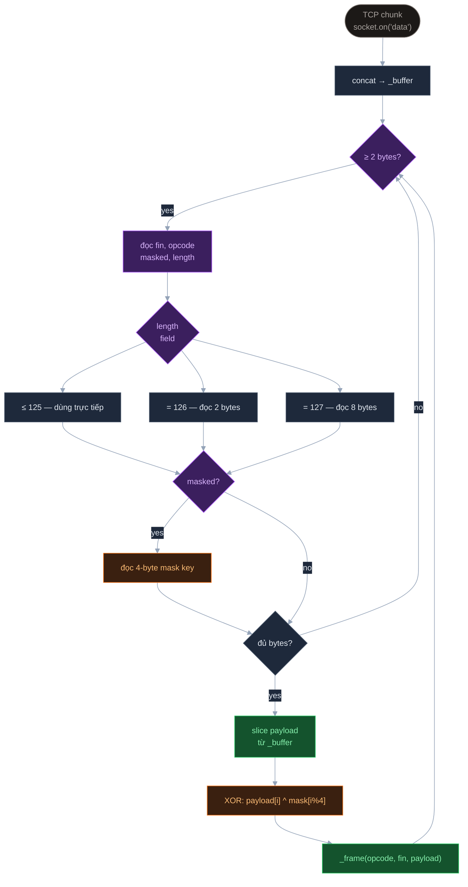
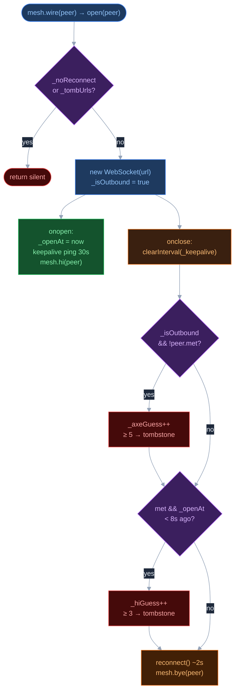

# WebSocket — Wire Layer

> **One-liner**: Hai file, hai chiều — `lib/websocket.js` implement WS protocol từ TCP socket lên (server side), `src/websocket.js` quản lý vòng đời outbound connection và tombstone logic (client side).

DAM chỉ cần `peer.wire` có `send(raw)` và `readyState`. Bất kỳ object nào implement interface này đều hoạt động — `ServerWire`, `NativeWebSocket`, UDP adapter, hay mock trong tests.

---

## `lib/websocket.js` — ba class phía server

**`WebSocketServer`** — nhận HTTP `upgrade` event, verify `Sec-WebSocket-Key`, ghi response 101, tạo `ServerWire`.

**`ServerWire`** — WS protocol thuần trên raw TCP socket. Không dùng `ws` npm package để giữ dependency tree tối thiểu.

**`NativeWebSocket`** — wrapper mỏng quanh `globalThis.WebSocket`, bridge `addEventListener` sang Node `EventEmitter` pattern (`onXxx` setter → `on/off`). Dùng khi relay cần connect ra ngoài.

### `ServerWire` — RFC 6455 frame parser



Parser không giả định mỗi TCP chunk = một WS frame — TCP có thể split hoặc merge tùy Nagle algorithm. `_buffer` accumulate đến khi đủ bytes mới parse.

**Opcode dispatch:**

| Opcode | Xử lý |
| --- | --- |
| `0x0` continuation | append `_fragments[]`, flush khi `fin=true` |
| `0x1` text | `emit('message', utf8 string)` |
| `0x2` binary | `emit('message', Buffer)` |
| `0x8` close | echo close frame + `socket.end()` |
| `0x9` ping | echo pong `0xa` |
| `0xa` pong | no-op — DAM dùng DAM-level ping/pong riêng |

RFC 6455 yêu cầu browser luôn mask frame gửi lên server. Server → client không mask. `ServerWire` unmask khi `masked bit = 1`.

---

## `src/websocket.js` — outbound lifecycle và tombstone



### Tombstone — hai counter độc lập

**`_axeGuess`** — tăng khi connect thành công nhưng đóng trước khi HI exchange xong (`peer.met = false`). Nguyên nhân thường gặp: AXE PID-sort drop một phía ngay sau TCP handshake. Sau 5 lần → tombstone.

**`_hiGuess`** — tăng khi peer đã qua HI (`peer.met = true`) nhưng đóng trong vòng 8s. Nguyên nhân: AXE drop sau handshake nhưng trước khi connection ổn định. Sau 3 lần → tombstone.

Tombstone lưu URL theo 3 dạng vì DAM và AXE dùng cả `wss://` lẫn `https://` làm key cho cùng relay:

```js
opt._tombUrls.add(peer.url);                          // wss://relay.x
opt._tombUrls.add(peer.url.replace(/^wss?/, 'http')); // https://relay.x
opt._tombUrls.add(peer.url.replace(/^https?/, 'ws')); // ws://relay.x
```

**Tombstone không persist qua restart** — chỉ tồn tại trong `opt._tombUrls` (in-memory `Set`). Relay bị tombstone được thử lại sau tab reload hoặc process restart.

### Reconnect và keepalive

Reconnect delay cố định ~2s, không có exponential backoff. Khi network partition, nhiều node reconnect cùng lúc → thundering herd vào relay. Đây là known trade-off ưu tiên simplicity.

Trên browser khi tab bị ẩn (`document.hidden`), reconnect loop pause cho đến khi tab visible — tránh wakeup không cần thiết trên mobile.

Keepalive ping (`setInterval(mesh.ping, 30s)`) dùng `peer.wire === wire` để check identity — đảm bảo interval chỉ ping đúng wire instance đã tạo ra nó, không phải wire mới sau reconnect. Proxy thường idle timeout 60s; ping 30s giữ connection khỏi bị close silently ở tầng network.

---

## Tham khảo

| Điểm yếu / trade-off | |
| --- | --- |
| **Fixed 2s reconnect** | Thundering herd sau partition |
| **Tombstone không reset** | `_axeGuess`/`_hiGuess` không clear khi connection ổn định trở lại |
| **Buffer unbounded** | `_buffer` trong `ServerWire` không có size cap — fragmented message lớn tích lũy RAM |
| **No compression** | Không support `permessage-deflate` extension |

| File | Vai trò |
| --- | --- |
| [lib/websocket.js](../../lib/websocket.js) | WS protocol — `NativeWebSocket`, `ServerWire`, `WebSocketServer` |
| [src/websocket.js](../../src/websocket.js) | Outbound lifecycle, tombstone, reconnect — side-effect only |
| [src/mesh.js](../../src/mesh.js) | DAM — gọi `peer.wire.send()` và `mesh.wire(peer)` |
