# discover.js — Self IP/Domain Discovery

> **One-liner**: Relay node cần biết địa chỉ của chính mình để advertise cho peer khác — `disc()` tìm địa chỉ đó theo 8 nguồn theo thứ tự ưu tiên, offline-first, không block nếu nguồn nào fail.

Server-only (`lib/`). Browser không gọi `disc()` — browser không có địa chỉ cố định để advertise.

---

## Fallback chain — thứ tự và logic

```mermaid
%%{init: {'theme': 'base', 'themeVariables': {
  'fontSize': '14px',
  'primaryColor': '#1e293b',
  'primaryTextColor': '#e2e8f0',
  'primaryBorderColor': '#475569',
  'lineColor': '#94a3b8',
  'secondaryColor': '#0f172a',
  'tertiaryColor': '#1e293b',
  'background': '#0f172a',
  'mainBkg': '#1e293b',
  'nodeBorder': '#475569',
  'clusterBkg': '#0f172a',
  'clusterBorder': '#334155',
  'titleColor': '#94a3b8',
  'edgeLabelBackground': '#1e293b'
}}}%%
graph TB
    START(["disc(opt)"])

    OPT{"opt.domain\nprovided?"}
    SKIP_ALL(["dùng opt.domain\nkhông discover gì cả"])

    FILE{"~/.config/zen/domain\nexists?"}
    USE_FILE["dom = file content\nsrc = 'config'"]

    PAR["glip() + glip6() — sync, parallel\nLAN IPv4 + IPv6"]

    STUN_CHK{"dom still null?"}
    STUN["await Promise.all\nstun() + stun6()\ntimeout 3s each"]
    STUN_WIN["ip = public IPv4\nsrc = 'stun'"]

    HTTP_CHK{"dom null\n&& STUN failed?"}
    HTTP["await hget() sequential\nipify → ifconfig.me\ntimeout 3s each"]
    HTTP_WIN["ip = public IPv4\nsrc = 'http'"]

    IP6_CHK{"ip6 still null?"}
    HTTP6["await hget6()\napi6.ipify.org"]

    SAVE{"dom && !noSave\n&& !opt.domain\n&& file not exist?"}
    PERSIST["writeFileSync(DOMF)\npersist for next run"]

    RET(["return { domain, ip, ip6, port, source }"])

    START --> OPT
    OPT -->|yes| SKIP_ALL --> RET
    OPT -->|no| FILE
    FILE -->|yes| USE_FILE --> PAR
    FILE -->|no| PAR
    PAR --> STUN_CHK
    STUN_CHK -->|yes| STUN
    STUN -->|IPv4 found| STUN_WIN --> HTTP_CHK
    STUN -->|fail| HTTP_CHK
    HTTP_CHK -->|yes| HTTP --> HTTP_WIN --> IP6_CHK
    HTTP_CHK -->|no| IP6_CHK
    IP6_CHK -->|yes| HTTP6 --> SAVE
    IP6_CHK -->|no| SAVE
    SAVE -->|yes| PERSIST --> RET
    SAVE -->|no| RET

    style START fill:#1e3a5f,stroke:#3b82f6,color:#93c5fd
    style OPT fill:#3b1f5e,stroke:#a855f7,color:#d8b4fe
    style SKIP_ALL fill:#14532d,stroke:#22c55e,color:#86efac
    style FILE fill:#3b1f5e,stroke:#a855f7,color:#d8b4fe
    style USE_FILE fill:#14532d,stroke:#22c55e,color:#86efac
    style PAR fill:#1e3a5f,stroke:#3b82f6,color:#93c5fd
    style STUN_CHK fill:#3b1f5e,stroke:#a855f7,color:#d8b4fe
    style STUN fill:#3a2010,stroke:#f97316,color:#fdba74
    style STUN_WIN fill:#14532d,stroke:#22c55e,color:#86efac
    style HTTP_CHK fill:#3b1f5e,stroke:#a855f7,color:#d8b4fe
    style HTTP fill:#3a2010,stroke:#f97316,color:#fdba74
    style HTTP_WIN fill:#14532d,stroke:#22c55e,color:#86efac
    style IP6_CHK fill:#3b1f5e,stroke:#a855f7,color:#d8b4fe
    style HTTP6 fill:#3a2010,stroke:#f97316,color:#fdba74
    style SAVE fill:#3b1f5e,stroke:#a855f7,color:#d8b4fe
    style PERSIST fill:#1e3a5f,stroke:#3b82f6,color:#93c5fd
    style RET fill:#14532d,stroke:#22c55e,color:#86efac
```



Một số điểm không hiển nhiên từ code:

**`glip()` + `glip6()` chạy sync** trước khi await bất cứ gì — chúng dùng `execSync` với timeout 2s. IPv4 và IPv6 local discovery luôn chạy bất kể có domain hay không, vì `ip` và `ip6` được trả về trong result kể cả khi `dom` đã có từ file.

**STUN và HTTP không chạy song song với nhau** — HTTP chỉ await sau khi STUN fail. Lý do: nếu STUN thành công (có public IP), HTTP call là lãng phí; nếu STUN fail (không có UDP/NAT block), HTTP là fallback cần thiết.

**STUN IPv4 và IPv6 chạy song song** (`Promise.all`) — cả hai cùng timeout 3s, không đợi nhau.

**Domain persistence chỉ ghi một lần** — điều kiện `!rft(DOMF)` đảm bảo không overwrite file đã có. Relay khởi động lần đầu → discover → save. Lần sau → đọc file, bỏ qua toàn bộ network discovery. Muốn reset: xóa file `~/.config/zen/domain`.

---

## STUN — tìm public IP sau NAT

STUN (RFC 5389) là cách duy nhất để relay sau NAT biết public IP của mình mà không cần external service phức tạp. `discover.js` implement minimal STUN client — chỉ `Binding Request`, không có authentication hay relay.

### Packet structure

```text
Binding Request (20 bytes):
  [0-1]  0x0001         — message type: Binding Request
  [2-3]  0x0000         — message length: 0 (no attributes)
  [4-7]  0x2112A442     — magic cookie (RFC 5389)
  [8-19] random 12 bytes — transaction ID

Response attributes được parse từ byte 20 trở đi:
  [+0] type (2 bytes)
  [+2] length (2 bytes)
  [+4] value (length bytes, padded to 4-byte boundary)
```

Code tìm attribute `0x0020` (XOR-MAPPED-ADDRESS) hoặc `0x0001` (MAPPED-ADDRESS, RFC 3489 cũ):

```js
// XOR-MAPPED-ADDRESS (0x0020) — IPv4:
ip = [
  (msg[off + 8]  ^ 0x21).toString(), // byte 0 XOR với magic cookie byte 0
  (msg[off + 9]  ^ 0x12).toString(), // byte 1 XOR với magic cookie byte 1
  (msg[off + 10] ^ 0xA4).toString(), // byte 2 XOR với magic cookie byte 2
  (msg[off + 11] ^ 0x42).toString(), // byte 3 XOR với magic cookie byte 3
].join(".");
```

**Tại sao XOR?** RFC 5389 XOR địa chỉ với magic cookie để tránh ALG (Application Layer Gateway) trên một số router cũ tự động rewrite địa chỉ IP trong payload UDP. Nếu NAT thấy IP thật trong payload, nó có thể "fix" nó — làm hỏng response. XOR che giấu địa chỉ khỏi ALG.

**IPv6 XOR phức tạp hơn** — 4 byte đầu XOR với magic cookie, 12 byte còn lại XOR với transaction ID (96-bit). Code giữ `txid = buf.slice(8, 20)` trước khi gửi để dùng cho decode.

**Attribute padding:** `off += 4 + len + (len % 4 ? 4 - (len % 4) : 0)` — mỗi attribute được padding lên bội số của 4 bytes. Nếu bỏ padding này, parser sẽ lệch offset và không tìm được attribute đúng.

---

## `isGlobalIPv6` — tại sao dùng `URL` trick

```js
canonical = new URL("http://[" + addr + "]").hostname.slice(1, -1).toLowerCase();
```

IPv6 có nhiều dạng viết tắt: `::1`, `0:0:0:0:0:0:0:1`, `::0001` — tất cả đều là loopback. Regex match prefix không đáng tin. `new URL()` normalize về canonical form theo WHATWG URL spec, sau đó chỉ cần check prefix đơn giản:

| Prefix | Ý nghĩa | Lọc ra |
| --- | --- | --- |
| `::1` | loopback | ✓ |
| `fe80` | link-local | ✓ |
| `fc`, `fd` | unique-local (RFC 4193) | ✓ |
| `ff` | multicast | ✓ |
| `::` | unspecified | ✓ |

`net.isIPv6(addr)` check trước để tránh `new URL()` throw với input rác.

---

## `hwid()` — hardware identity

```js
export function hwid() {
  // /etc/machine-id — 128-bit UUID, set at OS install
  // first non-loopback MAC — sorted for determinism
  // hostname — weak fallback
  return [mid, mac, hn].filter(Boolean).join("|") || null;
}
```

`hwid()` trả về entropy string ổn định qua restart, dùng làm seed cho node identity khi chưa có keypair. Không phải crypto-secure — chỉ đủ để phân biệt node trong cùng mạng.

**Tại sao sort MAC?** Interface rename (`eth0` → `enp3s0`) xảy ra sau kernel update hoặc khi thêm NIC. Sort theo tên interface đảm bảo luôn lấy cùng một MAC dù thứ tự interface thay đổi.

**Container note:** Trong container không có `/etc/machine-id` và MAC là `00:00:00:00:00:00` → `hwid()` trả về `null`. Caller cần handle case này.

---

## Tham khảo

**Output của `disc()`:**

```js
{
  domain: "203.0.113.42",      // dùng để advertise cho peer — có thể là IP hoặc hostname
  ip:     "203.0.113.42",      // public IPv4
  ip6:    "2001:db8::1",       // public IPv6, hoặc null
  port:   8420,                // từ opt.port, file, hoặc default
  source: "stun"               // "opt" | "config" | "stun" | "http" | "ip"
}
```

`source` hữu ích để debug — relay log `source: "http"` nghĩa là STUN bị block (NAT không cho UDP ra ngoài hoặc firewall block port 19302).

| File | Vai trò |
| --- | --- |
| [lib/discover.js](../../lib/discover.js) | `disc()`, `hwid()` — main exports |
| [lib/xdg.js](../../lib/xdg.js) | XDG config dir — `~/.config/zen/` trên Linux |
