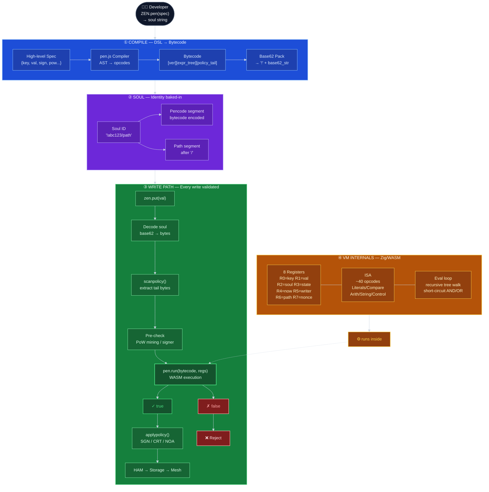

# PEN Policy VM — Overview

> **One-liner**: PEN = một bytecode VM nhỏ (Zig → WASM) nhúng thẳng vào soul ID, cho phép bất kỳ node nào trong graph tự mang theo "luật kiểm soát write" của riêng nó — không cần server, không cần auth service.

---

## Bức tranh tổng thể



---

## Index — 8 lớp chi tiết

| #   | Lớp                  | Nội dung                                                                                    | File                                         |
| --- | -------------------- | ------------------------------------------------------------------------------------------- | -------------------------------------------- |
| 1   | **Soul Encoding**    | Bytecode sống trong ID — format `!base62/path`, base62, policy tail, immutability           | [01_soul-encoding.md](01_soul-encoding.md)   |
| 2   | **ISA**              | ~40 opcodes chia 8 nhóm: Literals, Control, Compare, Arith, String, Type, Macros, Shortcuts | [02_isa.md](02_isa.md)                       |
| 3   | **Registers**        | 8 inputs cố định (key, val, soul, state, now, writer, path, nonce) + 4 LET locals           | [03_registers.md](03_registers.md)           |
| 4   | **Write Pipeline**   | 7 bước từ `zen.put()` đến storage: decode → scanpolicy → PoW mine → VM → PoW verify → auth  | [04_write-pipeline.md](04_write-pipeline.md) |
| 5   | **Policy Tail**      | 4 chế độ auth: SGN (ECDSA), CRT (certificate), NOA (open), PoW                              | [05_policy-tail.md](05_policy-tail.md)       |
| 6   | **PoW**              | Canonical block, SHA-256 mining, anti-replay binding, difficulty config                     | [06_pow.md](06_pow.md)                       |
| 7   | **Compiler DSL**     | `ZEN.pen(spec)` — viết policy bằng JS thay vì bytecode tay, ví dụ thực tế                   | [07_compiler-dsl.md](07_compiler-dsl.md)     |
| 8   | **ZACP Integration** | Protocol dùng PEN: inboxSoul, chanSoul, dmSoul, candle key                                  | [08_zacp.md](08_zacp.md)                     |

---

## Mental Model tổng kết

```
PEN = Bytecode VM nhỏ nhất có thể
    + Được pack vào soul ID (không thể thay đổi)
    + Chạy mỗi lần có write đến soul đó
    + Nhận 8 registers về write context
    + Return true/false
    + Kết hợp với policy tail (sign/cert/open/pow)
    + Không có side effects, không có network calls
    + Mọi peer đều verify được độc lập
```

**Cách nhớ 4 layer của PEN:**

1. **Soul** = bytecode encoded as ID (immutable contract) → [Lớp 1](01_soul-encoding.md)
2. **Predicate** = VM eval — "data này có hợp lệ không?" → [Lớp 2](02_isa.md) + [Lớp 3](03_registers.md)
3. **Policy** = auth mode — "người này có quyền không?" → [Lớp 5](05_policy-tail.md)
4. **PoW** = anti-spam — "người này có bỏ công sức không?" → [Lớp 6](06_pow.md)

Tất cả 4 layer đều được enforce **tại mọi peer**, **không cần server**, **không cần out-of-band communication**.

---

## Điểm mạnh

| #   | Điểm mạnh                  | Chi tiết                                                          |
| --- | -------------------------- | ----------------------------------------------------------------- |
| 1   | **Serverless enforcement** | Mọi peer đều verify được — không cần trust server                 |
| 2   | **Policy immutable**       | Bytecode baked vào soul ID, không thể thay đổi sau khi tạo        |
| 3   | **Composable**             | AND/OR/NOT → ghép policy phức tạp tùy ý                           |
| 4   | **Canonical PoW binding**  | Nonce bind (soul+key+val+state) → replay attack blocked           |
| 5   | **Deterministic VM**       | Không có side effects, không có callbacks vào JS, pure evaluation |
| 6   | **Short-circuit eval**     | AND/OR dừng sớm → hiệu quả với predicate lớn                      |
| 7   | **Time-window candle**     | Tự nhiên chống replay key cũ trong messaging                      |
| 8   | **Compact encoding**       | Base62 → URL-safe, dùng được làm path segment                     |

---

## Điểm yếu

| #   | Điểm yếu                      | Tác động                                                                               |
| --- | ----------------------------- | -------------------------------------------------------------------------------------- |
| 1   | **WASM dependency**           | Nếu browser không load WASM → toàn bộ PEN fail. Vi phạm "1 JS file" promise            |
| 2   | **String max 128 bytes**      | Value type trong VM capped ở 128 bytes — không validate được long string content       |
| 3   | **Opaque bytecode**           | Khi write bị reject, developer không biết tại sao (predicate nào fail?)                |
| 4   | **No dynamic state**          | Predicate không đọc được data khác trong graph — không thể "kiểm tra membership table" |
| 5   | **Policy frozen at creation** | Soul ID cố định → muốn thay đổi policy phải tạo soul mới, migrate data                 |
| 6   | **PoW difficulty fixed**      | Không thể adaptive difficulty — spam tăng → phải tạo soul mới với difficulty cao hơn   |
| 7   | **REGEX stub**                | Opcode 0x59 REGEX tồn tại trong ISA nhưng luôn return false trong core                 |
| 8   | **Low discoverability**       | Soul ID chứa bytecode opaque → khó debug, khó inspect bằng mắt                         |
