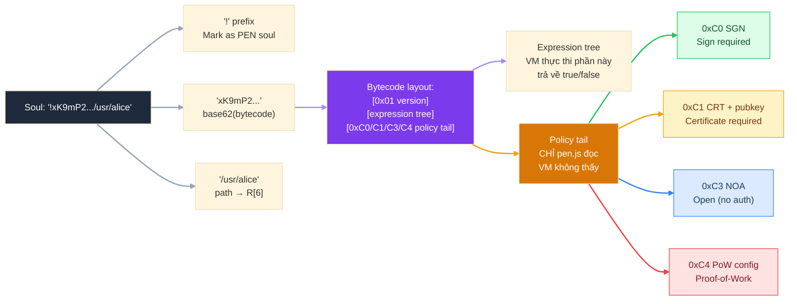

# Lớp 1 — Soul Encoding: Bytecode sống trong ID

> **Ý tưởng cốt lõi**: Thay vì lưu "luật ghi dữ liệu" ở một server riêng, PEN *nhúng trực tiếp luật đó vào tên của node*. Ai cũng có thể đọc luật chỉ bằng cách nhìn vào soul ID — không cần hỏi ai.

---

## Soul là gì?

Soul là **chuỗi định danh duy nhất** cho mỗi node trong Zen graph — tương tự như URL của một tài nguyên. Mỗi node có đúng một soul, và soul đó không bao giờ thay đổi.

Với PEN soul, định danh đó *chứa luôn bytecode* của policy:

```
"!" + base62(bytecode) + "/" + path_segment
 │         │                       │
 │         └── predicate + policy  └── R[6] register value
 └── prefix = "đây là PEN soul"
```

**Ví dụ thực tế:**
```
!xK9mP2qR8.../usr/alice
│           │   │
│           │   └── path: "usr/alice" → nạp vào R[6]
│           └── dấu phân tách
└── "!" + chuỗi base62 chứa toàn bộ bytecode
```

---

## Cấu trúc bên trong Bytecode



Bytecode có 3 phần:

| Phần            | Nội dung                                      | Ai dùng                       |
| --------------- | --------------------------------------------- | ----------------------------- |
| `[0x01]`        | Version byte                                  | Tất cả                        |
| Expression tree | Opcodes kiểm tra key/val/path/...             | VM (Zig/WASM) thực thi        |
| Policy tail     | 1 byte chỉ định auth mode (+ optional pubkey) | `pen.js` đọc trước khi gọi VM |

> **Tại sao tách biệt?** VM chỉ cần biết "data có hợp lệ không?" (true/false). Việc "người này có quyền không?" là câu hỏi khác — được xử lý bởi policy tail *sau khi* VM pass.

---

## Tại sao Base62?

Bytecode là binary (bytes 0x00–0xFF). Không thể dùng trực tiếp trong URL hay path.

**Base62** dùng bộ ký tự `[0-9A-Za-z]` — 62 ký tự:
- URL-safe: không có `+`, `/`, `=` cần encode
- Dùng được trong path segment (sau dấu `/`)
- Human-readable hơn base64 một chút
- Mật độ cao hơn hex (hex cần 2 ký tự/byte, base62 ≈ 1.34 ký tự/byte)

---

## Policy Tail — 4 chế độ xác thực

Byte cuối cùng của bytecode quyết định **ai được phép ghi**:

| Opcode | Tên          | Ý nghĩa                             | Dùng khi                          |
| ------ | ------------ | ----------------------------------- | --------------------------------- |
| `0xC0` | SGN          | Writer phải ký bằng private key     | Profile cá nhân, owned data       |
| `0xC1` | CRT + pubkey | Writer phải có certificate từ owner | Channel thành viên, invite-only   |
| `0xC3` | NOA / OPEN   | Không cần auth — ai cũng ghi được   | Public data, collaborative spaces |
| `0xC4` | PoW config   | Writer phải mine proof-of-work      | Anti-spam inbox, rate limiting    |

> SGN và CRT là về **danh tính** (ai?). PoW là về **nỗ lực** (có bỏ công sức không?). NOA là không hỏi gì cả.

---

## Immutability — Điều quan trọng nhất

Vì bytecode được **baked vào soul ID**, soul ID là **bất biến**:

```
Soul ID thay đổi  ⟺  Bytecode thay đổi  ⟺  Đây là soul khác hoàn toàn
```

Điều này có nghĩa là:
- Không thể "upgrade" policy của một soul đang tồn tại
- Nếu muốn thay đổi luật → phải tạo soul mới + migrate data
- Mọi peer cũ vẫn enforce đúng policy cũ nếu họ có soul ID cũ

Đây là **thiết kế có chủ ý**: policy phải predictable và tamper-proof.

---

## Xem thêm

- [Lớp 2 — ISA: Tập lệnh VM](02_isa.md) — các opcodes bên trong expression tree
- [Lớp 3 — Registers](03_registers.md) — 8 registers được nạp vào mỗi lần validate
- [Lớp 4 — Write Pipeline](04_write-pipeline.md) — luồng từ `zen.put()` đến storage
- [Lớp 5 — Policy Tail](05_policy-tail.md) — 4 chế độ auth chi tiết hơn
