# Lớp 2 — ISA: Tập lệnh của VM

> **Ý tưởng cốt lõi**: VM của PEN chỉ cần trả lời một câu hỏi — *"Write này có hợp lệ không?"* Vì vậy ISA được thiết kế tối giản: không có I/O, không có memory allocation, không có loops — chỉ có evaluation thuần túy.

---

## Tổng quan 8 nhóm opcode

```mermaid
%%{init: {'theme': 'base', 'themeVariables': {'fontSize': '13px', 'primaryColor': '#0F172A', 'primaryTextColor': '#F8FAFC', 'primaryBorderColor': '#475569', 'lineColor': '#94A3B8', 'background': '#0F172A', 'nodeBorder': '#475569', 'clusterBkg': '#1E293B', 'titleColor': '#F8FAFC', 'edgeLabelBackground': '#1E293B'}}}%%
graph LR
    ISA{{"ISA — ~40 Opcodes"}}

    subgraph LEFT[ ]
        direction TB
        LIT["📦 Literals

0x00 NULL
0x01 TRUE / 0x02 FALSE
0x03 STR len utf8
0x04 UINT  ULEB128
0x07 INT  SLEB128
0x08 F64  big-endian
0x10 REG n"]

        CTRL["🔀 Control

0x20 AND n  short-circuit
0x21 OR n  short-circuit
0x22 NOT
0x23 PASS  always true
0x24 FAIL  always false
0x70 LET slot def body
0x71 IF cond then else"]

        CMP["⚖️ Compare

0x30 EQ / 0x31 NE
0x32 LT / 0x33 GT
0x34 LTE / 0x35 GTE"]

        ARITH["🔢 Arithmetic

0x40 ADD / 0x41 SUB
0x42 MUL / 0x43 DIVU
0x44 MOD / 0x45 DIVF
0x46 ABS / 0x47 NEG"]
    end

    subgraph RIGHT[ ]
        direction TB
        STR["🔤 String

0x50 LEN
0x51 SLICE str s e
0x52 SEG str sep idx
0x53 TONUM / 0x54 TOSTR
0x55 CONCAT
0x56 PRE / 0x57 SUF
0x58 INCLUDES
0x5A UPPER / 0x5B LOWER"]

        TYPE["🏷️ Type check

0x60 ISS  is string?
0x61 ISN  is number?
0x62 ISX  is null?
0x63 ISB  is bool?
0x64 LNG min max"]

        MACRO["⚡ Macros

0x80 SEGR reg sep idx
0x81 SEGRN → TONUM SEG"]

        SHORT["🏃 Shortcuts

0xE0-0xEF inline 0-15
0xF0-0xF5 REG 0 - REG 5
0xF8-0xFB local 0 - local 3"]
    end

    ISA --> LEFT
    ISA --> RIGHT

    style ISA fill:#1E293B,color:#F8FAFC,stroke:#64748B,stroke-width:2px
    style LEFT fill:#0F172A,stroke:#334155,stroke-width:1px
    style RIGHT fill:#0F172A,stroke:#334155,stroke-width:1px
    style LIT fill:#1E3A5F,stroke:#3B82F6,color:#BFDBFE,stroke-width:2px
    style CTRL fill:#14532D,stroke:#22C55E,color:#BBF7D0,stroke-width:2px
    style CMP fill:#78350F,stroke:#F59E0B,color:#FEF3C7,stroke-width:2px
    style ARITH fill:#7F1D1D,stroke:#EF4444,color:#FEE2E2,stroke-width:2px
    style STR fill:#3B0764,stroke:#A855F7,color:#E9D5FF,stroke-width:2px
    style TYPE fill:#064E3B,stroke:#10B981,color:#A7F3D0,stroke-width:2px
    style MACRO fill:#7C2D12,stroke:#F97316,color:#FED7AA,stroke-width:2px
    style SHORT fill:#0C4A6E,stroke:#0EA5E9,color:#BAE6FD,stroke-width:2px
```



---

## Chi tiết từng nhóm

### 📦 Literals — Đưa giá trị vào stack

Literals là cách bytecode nhúng các hằng số vào trong instruction stream.

| Opcode | Tên | Mô tả | Encoding |
|--------|-----|-------|---------|
| `0x00` | NULL | Giá trị null | 1 byte |
| `0x01` | TRUE | Boolean true | 1 byte |
| `0x02` | FALSE | Boolean false | 1 byte |
| `0x03` | STR | String literal | `[0x03][len:u8][utf8 bytes]` |
| `0x04` | UINT | Unsigned integer | ULEB128 (variable length) |
| `0x07` | INT | Signed integer | SLEB128 (variable length) |
| `0x08` | F64 | Float 64-bit | 8 bytes, big-endian |
| `0x10` | REG(n) | Đọc register n | `[0x10][n:u8]` |

> **ULEB128/SLEB128**: Encoding tiết kiệm space — số nhỏ (0–127) chỉ cần 1 byte, số lớn hơn dùng thêm byte. Phổ biến trong WASM và protobuf.

**Ví dụ — đọc register R[2] rồi so sánh với string `"alice"`:**

```text
Bytecode (hex):  30  10 02  03 05 61 6C 69 63 65
                 │   │  │   │  │  [a  l  i  c  e]
                 │   │  │   │  └─ len = 5
                 │   │  │   └──── 0x03 = STR opcode
                 │   │  └──────── n = 2  → REG(2)
                 │   └─────────── 0x10 = REG opcode
                 └─────────────── 0x30 = EQ
```
Stack sau khi thực thi: `[true]` nếu R[2] == `"alice"`, `[false]` nếu không.

---

### 🔀 Control — Logic và luồng thực thi

Đây là nhóm quan trọng nhất — quyết định cách kết hợp nhiều điều kiện:

| Opcode | Tên | Mô tả |
|--------|-----|-------|
| `0x20` | AND(n) | Tất cả n sub-expr phải true. **Short-circuit**: dừng ngay khi gặp false đầu tiên |
| `0x21` | OR(n) | Ít nhất 1 trong n sub-expr phải true. **Short-circuit**: dừng ngay khi gặp true đầu tiên |
| `0x22` | NOT | Đảo ngược kết quả |
| `0x23` | PASS | Luôn trả về true (no-op predicate) |
| `0x24` | FAIL | Luôn trả về false (block all writes) |
| `0x70` | LET | Bind một sub-expr vào local variable để dùng lại |
| `0x71` | IF | Conditional: `if cond then expr1 else expr2` |

**Ví dụ AND với short-circuit:**

```text
AND(3, [ISS(R1), LNG(R1, 1, 280), PRE(R0, "tweet_")])
         ↓
         Nếu R1 không phải string → dừng ngay, không check LNG hay PRE
```

---

### ⚖️ Compare — So sánh giá trị

| Opcode | Ý nghĩa |
|--------|---------|
| `0x30` EQ | Bằng nhau |
| `0x31` NE | Khác nhau |
| `0x32` LT | Nhỏ hơn |
| `0x33` GT | Lớn hơn |
| `0x34` LTE | Nhỏ hơn hoặc bằng |
| `0x35` GTE | Lớn hơn hoặc bằng |

**Ví dụ — chỉ cho phép ghi nếu R[5] (pubkey của writer) đúng là Alice:**

```text
EQ(R[5], "alice_pubkey")
→ true nếu writer ký bằng đúng key của Alice, false với bất kỳ ai khác
```

---

### 🔤 String — Xử lý chuỗi

Nhóm opcode phong phú nhất vì key/val/path đều là string:

| Opcode | Tên | Dùng để |
|--------|-----|---------|
| `0x50` LEN | Độ dài chuỗi | Kiểm tra length |
| `0x51` SLICE | Cắt chuỗi `[s:e]` | Lấy substring |
| `0x52` SEG | Tách theo separator, lấy index n | Parse structured keys như `"msg_1234"` |
| `0x53` TONUM | Chuyển string → number | Parse timestamp từ key |
| `0x54` TOSTR | Chuyển number → string | Format check |
| `0x55` CONCAT | Nối 2 chuỗi | Build expected values |
| `0x56` PRE | Kiểm tra prefix | Key phải bắt đầu bằng `"tweet_"` |
| `0x57` SUF | Kiểm tra suffix | Key phải kết thúc bằng `".json"` |
| `0x58` INCLUDES | Kiểm tra substring | Value chứa keyword nào đó |
| `0x5A` UPPER | Uppercase | Normalize |
| `0x5B` LOWER | Lowercase | Normalize |

> ⚠️ **Giới hạn**: String trong VM capped ở **128 bytes**. Đủ cho key/path validation, nhưng không validate được long content.

**Ví dụ — key phải có dạng `"msg_<id>"` và kết thúc bằng `".json"`:**

```text
SEG(R[0], "_", 0)   → lấy phần trước "_"  → phải là "msg"
SEG(R[0], "_", 1)   → lấy phần sau "_"    → id (dùng TONUM nếu cần số)
SUF(R[0], ".json")  → kiểm tra suffix      → true nếu kết thúc bằng ".json"
```

---

### 🏷️ Type Check — Kiểm tra kiểu dữ liệu

| Opcode | Kiểm tra |
|--------|---------|
| `0x60` ISS | Is String? |
| `0x61` ISN | Is Number? |
| `0x62` ISX | Is Null? |
| `0x63` ISB | Is Boolean? |
| `0x64` LNG | Length in range [min, max]? |

**Ví dụ — `LNG` kết hợp check kiểu + check length trong 1 opcode, thay vì phải viết 3 điều kiện riêng:**

```text
LNG(R[1], 1, 280)

tương đương với:
  ISS(R[1])          → R[1] phải là string
  LEN(R[1]) >= 1     → không được rỗng
  LEN(R[1]) <= 280   → không quá 280 ký tự (giới hạn tweet)
```

---

### ⚡ Macros — Shorthand cho pattern phổ biến

| Opcode | Tên | Tương đương |
|--------|-----|------------|
| `0x80` SEGR | Segment Register | `SEG(REG(n), sep, idx)` |
| `0x81` SEGRN | Segment Register to Number | `TONUM(SEG(REG(n), sep, idx))` |

**Ví dụ — validate candle key dạng `"candle_1714000000"` (prefix + unix timestamp):**

```text
SEGRN(R[0], "_", 1)

từng bước:
  R[0]              = "candle_1714000000"   (key của node)
  SEG(..., "_", 1)  = "1714000000"          (lấy phần sau "_")
  TONUM(...)        = 1714000000            (parse thành số để so sánh range)
```

---

### 🏃 Shortcuts — Encoding tiết kiệm

Thay vì `[0x10][0x00]` (2 bytes) để đọc R[0], dùng shortcut `[0xF0]` (1 byte):

| Range | Ý nghĩa |
|-------|---------|
| `0xE0`–`0xEF` | Inline integers 0–15 (thay cho UINT 0x04) |
| `0xF0`–`0xF5` | REG(0)–REG(5) shortcuts |
| `0xF8`–`0xFB` | local[0]–local[3] (LET variables) |

**Ví dụ — cùng một điều kiện, viết dài vs shortcut:**

```text
Dài:      10 00  →  REG opcode + n=0  (2 bytes để đọc R[0])
Shortcut: F0     →  REG(0) inline     (1 byte, tiết kiệm 50%)

Dài:      04 07  →  UINT opcode + value=7  (2 bytes)
Shortcut: E7     →  inline integer 7       (1 byte)
```

---

## Bytecode trong thực tế — Ví dụ đọc tay

Policy "key phải bắt đầu bằng `tweet_`, val là string 1–280 ký tự":

```text
Bytecode (hex):  20 02  F0 56 03 07 74 77 65 65 74 5F  F1 64 01 18
                 │  │   │  │  │  │  [t w e e t _]     │  │  │  │
                 │  │   │  │  │  └─ STR "tweet_"      │  │  │  └─ max 280 (0x118 = 280, ULEB)
                 │  │   │  │  └──── 0x03 = STR opcode │  │  └──── min 1
                 │  │   │  └─────── 0x56 = PRE         │  └─────── LNG opcode
                 │  │   └────────── 0xF0 = R[0]        └────────── 0xF1 = R[1]
                 │  └────────────── 2 sub-expressions
                 └───────────────── 0x20 = AND
```

---

## Xem thêm

- [Lớp 1 — Soul Encoding](01_soul-encoding.md) — bytecode được pack vào soul ID như thế nào
- [Lớp 3 — Registers](03_registers.md) — 8 inputs mà VM nhận mỗi lần chạy
- [Lớp 7 — Compiler DSL](07_compiler-dsl.md) — viết policy bằng JS thay vì viết bytecode tay
