# Lớp 3 — Registers: Input của mỗi lần validate

> **Ý tưởng cốt lõi**: VM không có "database access" — nó chỉ nhìn thấy 8 giá trị về *write đang xảy ra*. Đây là toàn bộ context mà predicate có thể dùng để quyết định.

---

## 8 Registers cố định

Mỗi khi `zen.put(val)` được gọi trên một PEN soul, VM nhận đúng 8 registers này:

```mermaid
%%{init: {'theme': 'base', 'themeVariables': {'fontSize': '13px', 'primaryColor': '#0F172A', 'primaryTextColor': '#F8FAFC', 'primaryBorderColor': '#475569', 'lineColor': '#94A3B8', 'background': '#0F172A', 'clusterBkg': '#1E293B', 'titleColor': '#F8FAFC', 'edgeLabelBackground': '#1E293B'}}}%%
graph LR
    subgraph LEFT["Write context → Registers"]
        direction TB
        R0["R[0] = key

Key đang được ghi
shortcut: 0xF0"]
        R1["R[1] = val

Value đang được ghi
shortcut: 0xF1"]
        R2["R[2] = soul

Full soul string
shortcut: 0xF2"]
        R3["R[3] = state

HAM timestamp
shortcut: 0xF3"]
    end

    subgraph RIGHT[ ]
        direction TB
        R4["R[4] = now

Date.now() ms
shortcut: 0xF4"]
        R5["R[5] = writer

Writer's public key
shortcut: 0xF5"]
        R6["R[6] = path

Path after pencode/"]
        R7["R[7] = nonce

PoW nonce  ctx.put '^' "]
    end

    subgraph LOCALS["LET locals — runtime bindings"]
        direction TB
        L0["R[128] = local[0]
shortcut: 0xF8"]
        L1["R[129] = local[1]
shortcut: 0xF9"]
        L2["R[130] = local[2]
shortcut: 0xFA"]
        L3["R[131] = local[3]
shortcut: 0xFB"]
    end

    LEFT -. "LET opcode binds\nsub-expr result" .-> LOCALS
    RIGHT -. "LET opcode binds\nsub-expr result" .-> LOCALS

    style LEFT fill:#1E293B,stroke:#475569,color:#F8FAFC,stroke-width:1px
    style RIGHT fill:#1E293B,stroke:#475569,color:#F8FAFC,stroke-width:1px
    style LOCALS fill:#3B0764,stroke:#A855F7,color:#E9D5FF,stroke-width:2px
    style R0 fill:#1E3A5F,stroke:#3B82F6,color:#BFDBFE,stroke-width:2px
    style R1 fill:#1E3A5F,stroke:#3B82F6,color:#BFDBFE,stroke-width:2px
    style R2 fill:#1E3A5F,stroke:#3B82F6,color:#BFDBFE,stroke-width:2px
    style R3 fill:#1E3A5F,stroke:#3B82F6,color:#BFDBFE,stroke-width:2px
    style R4 fill:#14532D,stroke:#22C55E,color:#BBF7D0,stroke-width:2px
    style R5 fill:#14532D,stroke:#22C55E,color:#BBF7D0,stroke-width:2px
    style R6 fill:#14532D,stroke:#22C55E,color:#BBF7D0,stroke-width:2px
    style R7 fill:#14532D,stroke:#22C55E,color:#BBF7D0,stroke-width:2px
    style L0 fill:#4C1D95,stroke:#A855F7,color:#E9D5FF,stroke-width:2px
    style L1 fill:#4C1D95,stroke:#A855F7,color:#E9D5FF,stroke-width:2px
    style L2 fill:#4C1D95,stroke:#A855F7,color:#E9D5FF,stroke-width:2px
    style L3 fill:#4C1D95,stroke:#A855F7,color:#E9D5FF,stroke-width:2px
```



---

## Ý nghĩa từng register

| Register | Shortcut | Giá trị | Câu hỏi mà predicate có thể hỏi |
|----------|---------|---------|--------------------------------|
| R[0] | `0xF0` | Key đang được ghi | Key có đúng format không? Có prefix đúng không? |
| R[1] | `0xF1` | Value đang được ghi | Value có đúng type không? Có trong giới hạn length không? |
| R[2] | `0xF2` | Full soul string (`!...`) | Soul này có đúng như expected không? |
| R[3] | `0xF3` | HAM state timestamp (float ms) | Write này có trong cửa sổ thời gian không? |
| R[4] | `0xF4` | `Date.now()` tại thời điểm validate | Kiểm tra relative timing |
| R[5] | `0xF5` | Public key của người đang ghi | Writer có phải Alice không? |
| R[6] | — | Path segment (phần sau `/` trong soul) | Path có đúng không? |
| R[7] | — | PoW nonce (từ `ctx.put['^']`) | Nonce có hợp lệ không? (dùng trong PoW verify) |

---

## Các câu hỏi phổ biến — mapping sang registers

### "Chỉ Alice được ghi"
```javascript
EQ(R[5], alice_pubkey)   // R[5] = writer's public key
```

### "Key phải bắt đầu bằng 'msg_'"
```javascript
PRE(R[0], "msg_")        // R[0] = key being written
```

### "Value phải là string, 1–280 ký tự"
```javascript
AND(ISS(R[1]), LNG(R[1], 1, 280))   // R[1] = value
```

### "Chỉ ghi được trong cửa sổ thời gian (candle)"
```javascript
// Key = Math.floor(Date.now() / 300000)  ← candle index
// R[0] = key, R[4] = now
LTE(SEGRN(R[0], "_", 1), ADD(DIVU(R[4], 300000), 1))  // key <= now/300s + 1
GTE(SEGRN(R[0], "_", 1), SUB(DIVU(R[4], 300000), 2))  // key >= now/300s - 2
```

---

## LET locals — biến tạm trong VM

4 registers từ R[128]–R[131] là **biến local** tạo ra bởi opcode `LET`. Cú pháp:

```text
LET(slot, def, body)
      │     │     └── expression sử dụng local[slot]
      │     └──────── expression tính ra giá trị, lưu vào local[slot]
      └────────────── 0–3, tương ứng R[128]–R[131]
```

Mục đích: tính một sub-expression **một lần**, lưu vào local, dùng lại nhiều lần trong `body` — tránh tính lặp.

**Ví dụ — candle window: chỉ ghi được nếu key nằm trong cửa sổ thời gian hiện tại ±2 slot:**

```text
LET(
  slot = 0,
  def  = DIVU(R[4], 300000),        ← tính candle index hiện tại: now / 300s
                                        kết quả lưu vào local[0]
  body = AND(
    LTE(SEGRN(R[0], "_", 1), ADD(local[0], 1)),   ← key index <= now_slot + 1
    GTE(SEGRN(R[0], "_", 1), SUB(local[0], 2))    ← key index >= now_slot - 2
  )
)
```

Nếu không có `LET`, `DIVU(R[4], 300000)` phải viết lại 2 lần trong `body`. Với `LET`, tính 1 lần → dùng `local[0]` cho cả hai nhánh.

Không có side effects: `local[0]`–`local[3]` chỉ tồn tại trong scope của expression, không persist sau khi VM kết thúc.

---

## Điều VM KHÔNG thấy

Đây là giới hạn quan trọng cần hiểu:

| Thứ VM không thấy | Hệ quả |
|-------------------|--------|
| Data khác trong graph | Không thể kiểm tra "user có trong membership list không?" |
| Lịch sử write trước | Không thể "chỉ cho phép update nếu đã có giá trị trước" |
| Identity của peer relay | Không thể tin tưởng dựa trên nguồn gốc message |
| Network state | Validate không cần external dependency — VM chạy hoàn toàn local |

> Đây là trade-off có chủ ý: VM phải **deterministic và stateless** để mọi peer đều validate giống nhau mà không cần đồng bộ thêm data nào.

---

## Xem thêm

- [Lớp 2 — ISA](02_isa.md) — các opcode dùng để đọc và xử lý registers
- [Lớp 4 — Write Pipeline](04_write-pipeline.md) — registers được nạp vào VM tại bước nào
- [Lớp 6 — PoW](06_pow.md) — R[7] nonce được dùng như thế nào
