# Lớp 4 — Write Validation Pipeline

> **Ý tưởng cốt lõi**: Mỗi lần `zen.put()` được gọi trên PEN soul, write đó phải đi qua 7 bước kiểm tra. Tất cả xảy ra locally trên máy của người ghi — không có roundtrip server.

---

## Sơ đồ toàn bộ pipeline

```mermaid
%%{init: {'theme': 'base', 'themeVariables': {'fontSize': '13px', 'primaryColor': '#0F172A', 'primaryTextColor': '#F8FAFC', 'primaryBorderColor': '#475569', 'lineColor': '#94A3B8', 'background': '#0F172A', 'clusterBkg': '#1E293B', 'titleColor': '#F8FAFC', 'edgeLabelBackground': '#0F172A'}}}%%
graph TB
    subgraph TOP["① – ④  Chuẩn bị"]
        direction LR
        W(["zen.get(soul).put(val)"])
        W --> CHK{"Soul\nbắt đầu '!'?"}
        CHK -->|"Không"| PASS["Write thông thường\nBỏ qua PEN"]
        CHK -->|"Có"| DEC

        DEC["① Decode

base62 → bytes
Validate 2–512 bytes"]

        DEC --> SCAN["② scanpolicy()

Tree-skip qua expr
→ sign / cert / open / pow"]

        SCAN --> POW_CHK{"policy.pow\nchưa có nonce?"}
        POW_CHK -->|"Có"| MINE["③ Auto-mine

Build canonical block
Tăng nonce → hash
Đến khi prefix match"]
        POW_CHK -->|"Không"| AUTH
        MINE --> AUTH

        AUTH["④ Writer

sec.upub
|| authenticator.pub"]
    end

    subgraph BOT["⑤ – ⑦  Thực thi & xác thực"]
        direction LR
        VMRUN["⑤ VM Execution

pen.run(bytecode, regs)
Zig WASM eval loop"]

        VMRUN -->|"false"| FAIL1["❌ predicate failed"]
        VMRUN -->|"true"| POWVFY{"policy.pow?"}

        POWVFY -->|"Có"| HASHVFY["⑥ PoW Verify

hash(block + ':' + nonce)
Kiểm tra prefix"]
        POWVFY -->|"Không"| APPLYPOL

        HASHVFY -->|"Fail"| FAIL2["❌ PoW insufficient"]
        HASHVFY -->|"Pass"| APPLYPOL

        APPLYPOL["⑦ applypolicy()

SGN: verify ECDSA
CRT: verify certificate
NOA: pass through"]

        APPLYPOL -->|"OK"| NEXT["✅ HAM → Storage → Mesh"]
        APPLYPOL -->|"Fail"| FAIL3["❌ cert invalid"]
    end

    AUTH --> VMRUN

    style TOP fill:#0F172A,stroke:#334155,stroke-width:1px
    style BOT fill:#0F172A,stroke:#334155,stroke-width:1px
    style W fill:#1E293B,color:#F8FAFC,stroke:#64748B,stroke-width:2px
    style CHK fill:#1E293B,color:#F8FAFC,stroke:#64748B,stroke-width:2px
    style POW_CHK fill:#1E293B,color:#F8FAFC,stroke:#64748B,stroke-width:2px
    style POWVFY fill:#1E293B,color:#F8FAFC,stroke:#64748B,stroke-width:2px
    style PASS fill:#1E293B,color:#94A3B8,stroke:#475569,stroke-width:1px
    style DEC fill:#1E3A5F,stroke:#3B82F6,color:#BFDBFE,stroke-width:2px
    style SCAN fill:#1E3A5F,stroke:#3B82F6,color:#BFDBFE,stroke-width:2px
    style MINE fill:#3B0764,stroke:#A855F7,color:#E9D5FF,stroke-width:2px
    style AUTH fill:#1E3A5F,stroke:#3B82F6,color:#BFDBFE,stroke-width:2px
    style VMRUN fill:#78350F,stroke:#F59E0B,color:#FEF3C7,stroke-width:2px
    style HASHVFY fill:#1E3A5F,stroke:#3B82F6,color:#BFDBFE,stroke-width:2px
    style APPLYPOL fill:#14532D,stroke:#22C55E,color:#BBF7D0,stroke-width:2px
    style NEXT fill:#14532D,stroke:#22C55E,color:#BBF7D0,stroke-width:2px
    style FAIL1 fill:#7F1D1D,stroke:#EF4444,color:#FEE2E2,stroke-width:2px
    style FAIL2 fill:#7F1D1D,stroke:#EF4444,color:#FEE2E2,stroke-width:2px
    style FAIL3 fill:#7F1D1D,stroke:#EF4444,color:#FEE2E2,stroke-width:2px
```



---

## 7 bước chi tiết

### ① Decode — Giải mã soul

```javascript
// pen.js (src/pen.js)
var buf = pen.unpack(soul.slice(1, soul.indexOf('/')))
// soul.slice(1) bỏ '!' prefix
// indexOf('/') lấy phần pencode, bỏ path segment
```

- Base62 → raw bytes
- Validate: length phải trong khoảng 2–512 bytes
- Nếu invalid → throw ngay, không đi tiếp

---

### ② scanpolicy() — Đọc policy tail

`scanpolicy()` cần tìm policy tail mà **không thực thi bytecode**. Nó dùng kỹ thuật "tree-skip":

```
Bytecode: [0x20][2][0xF0][0x56][0x03][6][t][w][e][e][t][_]  [0xF1][0x64][1][0x18]  [0xC0]
                                                                                       ↑
                                                                               Policy tail ở đây
```

Tree-skip đọc structure của mỗi opcode (biết nó có bao nhiêu children) để nhảy qua toàn bộ expression tree → đến byte cuối cùng = policy tail.

Output: `{ sign: bool, cert: pubkey|null, open: bool, pow: config|null }`

---

### ③ Auto-mine PoW (nếu cần)

Nếu policy là PoW và caller đã bật `opt.pow = true`:

```javascript
// Xây canonical block
var block = JSON.stringify({ '#': soul, '.': key, ':': val, '>': state })
var nonce = 0
while (true) {
  var hash = sha256(block + ':' + nonce)
  if (hash.startsWith(unit.repeat(difficulty))) break
  nonce++
}
ctx.put['^'] = nonce  // lưu nonce vào R[7]
```

Xem thêm tại [Lớp 6 — PoW](06_pow.md).

---

### ④ Xác định Writer

```javascript
var writer = sec.upub                  // User đang đăng nhập
           || authenticator && authenticator.pub  // Hoặc auth service
           || null
```

Writer's public key → nạp vào `R[5]` trước khi gọi VM.

---

### ⑤ VM Execution — Trái tim của PEN

```javascript
var result = pen.run(bytecode, {
  0: key,     // R[0]
  1: val,     // R[1]
  2: soul,    // R[2]
  3: state,   // R[3]
  4: Date.now(), // R[4]
  5: writer,  // R[5]
  6: path,    // R[6]
  7: nonce,   // R[7]
})
// result = true hoặc false
```

`pen.run()` gọi vào WASM compiled từ `src/pen.zig`. VM thực thi expression tree, trả về boolean.

**Nếu false** → reject ngay, lỗi `"PEN: predicate failed"`.

---

### ⑥ PoW Verify (nếu policy là PoW)

Dù đã mine ở bước ③, peer *nhận* write sẽ verify lại:

```javascript
var block = JSON.stringify({ '#': soul, '.': key, ':': val, '>': state })
var hash = sha256(block + ':' + nonce)
if (!hash.startsWith(unit.repeat(difficulty))) {
  throw 'PEN: PoW insufficient'
}
```

Peer tự compute lại hash từ data — không cần trust sender đã mine đúng.

---

### ⑦ applypolicy() — Kiểm tra auth

| Policy | Hành động |
|--------|----------|
| NOA (0xC3) | Pass through — không làm gì |
| SGN (0xC0) | Verify ECDSA signature. Writer phải đã ký data bằng private key |
| CRT (0xC1) | Verify certificate từ owner. Writer phải có cert được owner cấp |

Nếu pass → data được chuyển tiếp vào HAM → Storage → Mesh.

---

## Tại sao thứ tự này?

```
Decode → scanpolicy → [PoW mine] → writer ID → VM → [PoW verify] → auth
```

- **scanpolicy trước VM**: Cần biết policy để chuẩn bị (mine PoW, lấy writer ID)
- **VM trước auth**: Predicate check rẻ hơn crypto verify — fail fast
- **PoW verify sau VM**: Tránh tốn CPU hash nếu predicate đã fail
- **applypolicy cuối**: Crypto verify tốn kém nhất — để cuối cùng

---

## Xem thêm

- [Lớp 1 — Soul Encoding](01_soul-encoding.md) — bytecode được decode từ đâu
- [Lớp 3 — Registers](03_registers.md) — 8 inputs nạp vào VM ở bước ⑤
- [Lớp 5 — Policy Tail](05_policy-tail.md) — 4 chế độ auth ở bước ⑦
- [Lớp 6 — PoW](06_pow.md) — chi tiết bước ③ và ⑥
