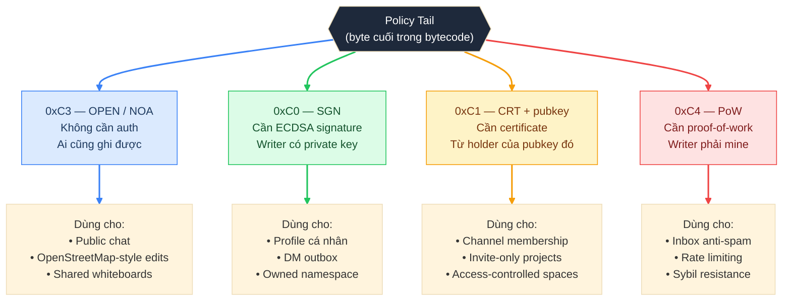

# Lớp 5 — Policy Tail: 4 chế độ xác thực

> **Ý tưởng cốt lõi**: Predicate (VM) trả lời "data hợp lệ không?". Policy tail trả lời câu hỏi khác: "người này có *quyền* ghi không?" Hai câu hỏi độc lập, cả hai đều phải pass.

---

## Tổng quan 4 chế độ



---

## NOA — Open (0xC3): Ai cũng ghi được

Không có auth. VM predicate pass → data được accept.

**Khi nào dùng:**
- Data public mà cộng đồng cùng contribute
- Proof-of-concept và prototyping
- Hệ thống đã có giới hạn khác (ví dụ: predicate check key format nghiêm ngặt)

**Rủi ro:** Ai cũng ghi được, kể cả bot spam. Cần kết hợp với predicate chặt hoặc thêm PoW nếu cần rate-limit.

---

## SGN — Sign (0xC0): ECDSA signature

Writer phải có private key tương ứng với public key được kỳ vọng.

### Cách hoạt động



```mermaid
%%{init: {'theme': 'base', 'themeVariables': {'fontSize': '14px'}}}%%
graph LR
    A["Alice (writer)"]
    SIGN["① Ký data bằng private key\nsig = ECDSA.sign(data, priv)"]
    PUT["PUT { val, sig, soul, key }"]
    VM["② VM check predicate\nkey/val format"]
    VERIFY["③ ECDSA.verify(data, sig, pub)\nRecover pubkey từ sig"]
    CHECK["④ Verify pubkey == R[5]\npubkey trong path/soul"]
    OK["✅ Accept"]
    FAIL["❌ Reject"]

    A --> SIGN
    SIGN --> PUT
    PUT --> VM
    VM --> VERIFY
    VERIFY --> CHECK
    CHECK --> OK
    CHECK --> FAIL

    style A fill:#DCFCE7,stroke:#22C55E,color:#14532D
    style SIGN fill:#F0FDF4,stroke:#86EFAC,color:#14532D
    style PUT fill:#1E293B,color:#94A3B8
    style VM fill:#FEF3C7,stroke:#F59E0B,color:#78350F
    style VERIFY fill:#FEF3C7,stroke:#F59E0B,color:#78350F
    style CHECK fill:#FEF3C7,stroke:#F59E0B,color:#78350F
    style OK fill:#DCFCE7,stroke:#22C55E,color:#14532D
    style FAIL fill:#FEE2E2,stroke:#EF4444,color:#7F1D1D
    linkStyle 0 stroke:#22C55E,stroke-width:2px
    linkStyle 1 stroke:#94A3B8,stroke-width:2px
    linkStyle 2 stroke:#94A3B8,stroke-width:2px
    linkStyle 3 stroke:#F59E0B,stroke-width:2px
    linkStyle 4 stroke:#F59E0B,stroke-width:2px
    linkStyle 5 stroke:#22C55E,stroke-width:2px
    linkStyle 6 stroke:#EF4444,stroke-width:2px
```

**Signature format** (86 chars base62 + recovery bit):
```
"~alice_pubkey/profile"  ← owned soul (tương tự)
value được signed: ZEN.sign(val, pair) → "<86chars>0:original_val"
                                               ↑ recovery bit (0 hoặc 1)
```

**Khi nào dùng:**
- Profile của người dùng: `path = alice_pubkey` + `sign: true` → chỉ Alice mới ghi được
- DM outbox: Tin nhắn gửi đi phải có chữ ký của người gửi

---

## CRT — Certificate (0xC1): Được cấp quyền bởi owner

Writer không cần tự chứng minh — cần có "giấy phép" từ một authority cụ thể.

### Cách hoạt động



```mermaid
%%{init: {'theme': 'base', 'themeVariables': {'fontSize': '14px'}}}%%
graph LR
    O["Owner (admin)"]
    CERT["① Cấp certificate\ncert = sign(bob_pub, owner_priv)"]
    B["Bob (member)"]
    PUT["PUT { val, cert, soul }"]
    VM["② VM predicate check"]
    VERIFY["③ ECDSA.verify(bob_pub, cert, owner_pub)"]
    CHECK["④ owner_pub match\npubkey trong CRT tail"]
    OK["✅ Bob accepted as member"]

    O --> CERT
    CERT --> B
    B --> PUT
    PUT --> VM
    VM --> VERIFY
    VERIFY --> CHECK
    CHECK --> OK

    style O fill:#FEF3C7,stroke:#F59E0B,color:#78350F
    style CERT fill:#FFFBEB,stroke:#FCD34D,color:#78350F
    style B fill:#DBEAFE,stroke:#3B82F6,color:#1E3A5F
    style PUT fill:#1E293B,color:#94A3B8
    style VM fill:#FEF3C7,stroke:#F59E0B,color:#78350F
    style VERIFY fill:#FEF3C7,stroke:#F59E0B,color:#78350F
    style CHECK fill:#FEF3C7,stroke:#F59E0B,color:#78350F
    style OK fill:#DCFCE7,stroke:#22C55E,color:#14532D
    linkStyle 0 stroke:#F59E0B,stroke-width:2px
    linkStyle 1 stroke:#F59E0B,stroke-width:2px
    linkStyle 2 stroke:#3B82F6,stroke-width:2px
    linkStyle 3 stroke:#94A3B8,stroke-width:2px
    linkStyle 4 stroke:#F59E0B,stroke-width:2px
    linkStyle 5 stroke:#F59E0B,stroke-width:2px
    linkStyle 6 stroke:#22C55E,stroke-width:2px
```

**Encoding của CRT tail:**
```
[0xC1][pubkey_length:u8][pubkey_bytes...]
        owner's public key embedded directly in soul bytecode
```

**Khi nào dùng:**
- Channel với invite-only: Admin cấp cert cho từng member
- Collaborative project: Owner mời contributor
- Khác SGN ở chỗ: nhiều người có thể được cấp quyền (cert từ cùng 1 owner), thay vì chỉ 1 người cố định

---

## PoW — Proof-of-Work (0xC4): Phải bỏ công sức

Writer phải giải một bài toán tính toán trước khi write được accept.

**Encoding:**
```
[0xC4][field=7][difficulty:u8][unitlen:u8][unit bytes...]
                     ↑               ↑           ↑
               số lần lặp      độ dài 1 unit   ký tự unit
```

**Ví dụ:** `difficulty=2, unit="0"` → hash phải bắt đầu bằng `"00"`.

Chi tiết về cơ chế mining và anti-replay xem tại [Lớp 6 — PoW](06_pow.md).

**Khi nào dùng:**
- Inbox anti-spam: Người gửi phải mine PoW → spam bot tốn CPU
- Rate limiting tự nhiên: Mining mất thời gian → không thể flood
- Sybil resistance: Tạo 1000 account gửi tin → cần mine 1000 lần

**Kết hợp phổ biến:**
```javascript
// DM soul: phải ký (danh tính) + phải mine (chống spam)
dmSoul(recipient) → { sign: true, pow: { unit: '0', difficulty: 1 } }
```

---

## So sánh 4 chế độ

| | NOA | SGN | CRT | PoW |
|--|-----|-----|-----|-----|
| **Ai được ghi** | Tất cả | Chỉ key holder | Ai có cert từ owner | Ai mine đủ |
| **Cần gì** | Không | Private key | Certificate từ owner | CPU time |
| **Verify bằng** | Không | ECDSA | ECDSA (cert) | SHA-256 hash |
| **Revoke được không** | — | Không (đổi soul) | Không (đổi soul) | Không |
| **Kết hợp được với PoW** | ✅ | ✅ | ✅ | — |

> **Lưu ý quan trọng**: Policy tail là **bất biến** — baked vào soul ID. Muốn thay đổi auth mode phải tạo soul mới.

---

## Xem thêm

- [Lớp 4 — Write Pipeline](04_write-pipeline.md) — policy tail được đọc và áp dụng tại bước nào
- [Lớp 6 — PoW](06_pow.md) — chi tiết proof-of-work, canonical block, anti-replay
- [Lớp 8 — ZACP Integration](08_zacp.md) — protocol thực tế dùng các chế độ này như thế nào
