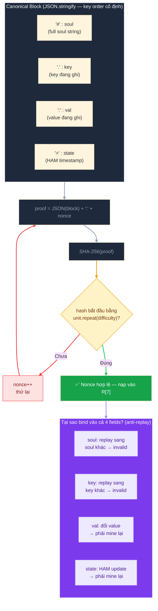

# Lớp 6 — PoW: Canonical Block & Anti-Replay

> **Ý tưởng cốt lõi**: PoW trong PEN không chỉ là "tìm số ngẫu nhiên" như Bitcoin. Nonce được **bind chặt vào (soul + key + val + state)** — nghĩa là mỗi write yêu cầu một nonce riêng, không tái dùng được.

---

## Bối cảnh: Tại sao cần PoW?

Trong hệ thống decentralized, không có server để rate-limit request. Bất kỳ ai cũng có thể:
- Tạo vô số account giả (Sybil attack)
- Gửi hàng nghìn message vào inbox của Alice
- Flood relay network

PoW giải quyết bằng cách: **gửi 1 message tốn N ms CPU**. Gửi 1000 messages → tốn 1000*N ms. Không cần server, không cần identity.

---

## Canonical Block — Cấu trúc dữ liệu cần hash

Trước khi mining, writer xây dựng "canonical block" — một JSON object có thứ tự field cố định:



---

## Ví dụ mining thực tế

```javascript
// Soul: !abc.../dm/alice_pub
// Key: 12345678  (candle timestamp)
// Val: "Hello Alice"
// State: 1700000001234.5 (HAM timestamp)

var block = JSON.stringify({
  '#': '!abc.../dm/alice_pub',
  '.': '12345678',
  ':': 'Hello Alice',
  '>': 1700000001234.5
})
// → '{"#":"!abc.../dm/alice_pub",".":"12345678",":":"Hello Alice",">":1700000001234.5}'

var nonce = 0
while (true) {
  var hash = sha256(block + ':' + nonce)
  if (hash.startsWith('0')) break  // difficulty=1, unit='0'
  nonce++
}
// Kết quả: nonce = 47 (ví dụ)
// Gửi write với ctx.put['^'] = 47 → nạp vào R[7]
```

---

## PoW Config Encoding trong Bytecode

```
[0xC4][field=7][difficulty:u8][unitlen:u8][unit bytes...]
  ↑       ↑          ↑              ↑           ↑
Policy  R[7] là    Số lần unit    Số bytes    Ký tự unit
 tail   nonce      lặp trong      trong unit  (ASCII)
 byte             hash prefix
```

**Ví dụ cụ thể:**
```
difficulty=2, unit='0'  →  hash phải bắt đầu bằng "00"
difficulty=3, unit='0'  →  hash phải bắt đầu bằng "000"  (khó hơn ~16x)
difficulty=1, unit='00' →  hash phải bắt đầu bằng "00"   (giống trên)
```

---

## Anti-Replay — 3 lớp bảo vệ

### Lớp 1: Không tái dùng nonce sang soul khác

```
Nonce đúng cho:  soul=!abc.../dm/alice  + key=123 + val="Hi"
Copy sang:       soul=!xyz.../dm/bob    + key=123 + val="Hi"

→ Block JSON khác → SHA-256 khác → prefix không match → FAIL
```

### Lớp 2: Không tái dùng khi thay đổi value

```
Nonce N hợp lệ cho:  val = "Hello Alice"
Sau đó thay đổi:     val = "Hello Alice. PS: ..."

→ Block JSON khác → phải mine nonce mới
```

### Lớp 3: HAM state update tự invalidate nonce cũ

```
Nonce N hợp lệ cho:  state = 1700000001234.5
HAM nhận write → state tăng lên 1700000001235.0
Attacker cố replay nonce N:

→ state trong block khác → SHA-256 khác → FAIL
```

---

## PoW trong thực tế — Độ khó vs. Chi phí

| Difficulty | Unit   | Expected hashes | Thời gian ~ (js) |
| ---------- | ------ | --------------- | ---------------- |
| 1          | `"0"`  | 16              | < 1ms            |
| 2          | `"0"`  | 256             | ~5ms             |
| 3          | `"0"`  | 4096            | ~80ms            |
| 1          | `"00"` | 256             | ~5ms             |
| 2          | `"00"` | 65536           | ~1.3s            |

**DM soul trong ZACP** dùng `difficulty=1, unit='0'` — đủ để làm chậm spammer nhưng không annoying cho người dùng thật.

---

## Giới hạn của PoW trong PEN

| Vấn đề                 | Chi tiết                                                          |
| ---------------------- | ----------------------------------------------------------------- |
| **Difficulty cố định** | Bytecode baked vào soul → không thể tăng difficulty khi spam tăng |
| **Hardware advantage** | GPU/ASIC mine nhanh hơn nhiều → người giàu có thể spam nhiều hơn  |
| **Không adaptive**     | Muốn thay đổi difficulty phải tạo soul mới + migrate              |

> Đây là trade-off thiết kế: simplicity vs. adaptive security. Với use case messaging thông thường, fixed difficulty là đủ.

---

## Xem thêm

- [Lớp 5 — Policy Tail](05_policy-tail.md) — PoW là 1 trong 4 policy mode
- [Lớp 4 — Write Pipeline](04_write-pipeline.md) — mining xảy ra ở bước ③, verify ở bước ⑥
- [Lớp 8 — ZACP Integration](08_zacp.md) — DM soul dùng PoW + sign kết hợp
