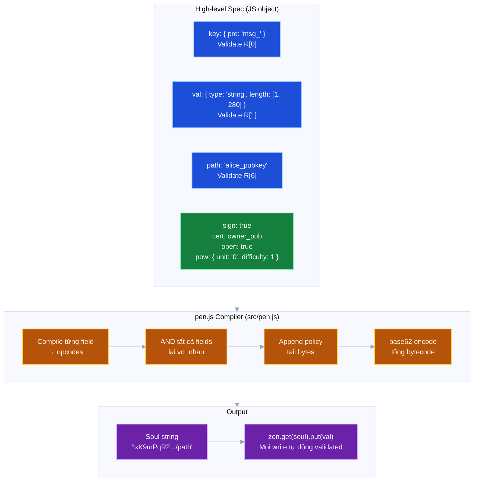

# Lớp 7 — Compiler DSL: Cách viết policy

> **Ý tưởng cốt lõi**: Không ai muốn viết bytecode tay. `ZEN.pen(spec)` nhận một JS object mô tả policy bằng ngôn ngữ tự nhiên, biên dịch thành bytecode, và trả về soul string sẵn sàng để dùng.

---

## Luồng biên dịch



---

## Anatomy của một spec

```javascript
const soul = ZEN.pen({
  // ── Validate KEY (R[0]) ──────────────────────────────────────
  key: {
    pre: 'tweet_',         // key phải bắt đầu bằng "tweet_"
    suf: '.json',          // key phải kết thúc bằng ".json"
    length: [1, 64],       // độ dài 1–64 ký tự
    type: 'string',        // phải là string
    eq: 'fixed_key',       // phải bằng đúng giá trị này
  },

  // ── Validate VALUE (R[1]) ─────────────────────────────────────
  val: {
    type: 'string',        // phải là string
    length: [1, 280],      // 1–280 ký tự
    pre: 'https://',       // phải bắt đầu bằng URL
    and: [                 // kết hợp nhiều điều kiện
      { type: 'string' },
      { length: [1, 280] }
    ],
    or: [                  // ít nhất 1 điều kiện đúng
      { type: 'string' },
      { type: 'number' }
    ],
  },

  // ── Validate PATH (R[6]) ──────────────────────────────────────
  path: alice_pubkey,      // path segment phải bằng pubkey này
                           // → trở thành EQ(R[6], alice_pubkey)

  // ── Auth mode (policy tail) ───────────────────────────────────
  sign: true,              // 0xC0 SGN — writer phải có private key
  cert: owner_pubkey,      // 0xC1 CRT — writer cần cert từ owner
  open: true,              // 0xC3 NOA — ai cũng ghi được
  pow: {                   // 0xC4 PoW
    unit: '0',
    difficulty: 1
  },
  // Chỉ 1 trong 4 được dùng — nếu nhiều hơn, sign > cert > pow > open
})
```

---

## Ví dụ thực tế

### Twitter-like tweet soul

```javascript
const tweetSoul = ZEN.pen({
  key: { pre: 'tweet_' },
  val: {
    and: [
      { type: 'string' },
      { length: [1, 280] }
    ]
  },
  path: alice_pubkey,
  sign: true
})
// soul = "!<bytecode>/alice_pubkey"
// Chỉ Alice có thể ghi tweet, key phải bắt đầu bằng "tweet_",
// val phải là string 1–280 ký tự
```

### Anti-spam inbox

```javascript
const inbox = ZEN.pen({
  path: recipient_pubkey,
  key: { type: 'number' },   // candle timestamp
  sign: true,                // sender phải có identity
  pow: { unit: '0', difficulty: 1 }  // + phải mine PoW
})
// Gửi vào inbox phải: có private key + mine PoW
```

### Invite-only channel

```javascript
const channel = ZEN.pen({
  path: `${project_id}/${channel_id}`,
  key: { type: 'number' },   // candle timestamp
  sign: true,
  cert: admin_pubkey         // cần cert từ admin
})
// Admin cấp cert cho mỗi member → member ghi được
```

### Public collaborative doc

```javascript
const doc = ZEN.pen({
  key: { and: [
    { type: 'string' },
    { length: [1, 64] }
  ]},
  val: { length: [0, 1024] },
  open: true                 // ai cũng ghi được
})
```

---

## Compiler internals — Cách spec → bytecode

### Bước 1: Compile từng field thành opcode tree

```
key: { pre: 'tweet_' }
  → PRE(REG(0), STR("tweet_"))
  → [0xF0][0x56][0x03][0x07]['t']['w']['e']['e']['t']['_']
```

```
val: { and: [{ type: 'string' }, { length: [1, 280] }] }
  → AND(ISS(REG(1)), LNG(REG(1), 1, 280))
  → [0x20][0x02][0xF1][0x60][0xF1][0x64][0x01][0x18 0x02]
                                                ↑    ↑
                                               1    280 (ULEB128: 280 = 0x18 + 0x02<<7)
```

### Bước 2: AND tất cả field conditions

Nếu có 3 field checks (key, val, path):
```
AND(3, [key_expr, val_expr, path_expr])
→ [0x20][0x03][key_opcodes...][val_opcodes...][path_opcodes...]
```

### Bước 3: Append policy tail

```
sign: true → append [0xC0]
cert: pubkey → append [0xC1][len][pubkey_bytes]
open: true → append [0xC3]
pow: config → append [0xC4][7][difficulty][unitlen][unit]
```

### Bước 4: base62 encode

```javascript
var full = [0x01, ...expr_bytes, ...tail_bytes]
var soul = '!' + base62(full) + '/' + (path_value || '')
```

---

## Debugging — Đọc lại spec từ soul

Hiện tại không có công cụ official để decode soul → spec. Đây là một trong những **điểm yếu** của PEN: bytecode opaque, khó debug bằng mắt.

Workaround: Lưu lại spec object cùng với soul khi tạo.

```javascript
const spec = { key: { pre: 'tweet_' }, val: { length: [1, 280] }, sign: true }
const soul = ZEN.pen(spec)
// Lưu: { soul, spec } để sau debug
```

---

## Xem thêm

- [Lớp 1 — Soul Encoding](01_soul-encoding.md) — soul string output của compiler trông như thế nào
- [Lớp 2 — ISA](02_isa.md) — các opcodes được emit ra
- [Lớp 8 — ZACP Integration](08_zacp.md) — protocol dùng compiler để tạo các soul chuẩn
