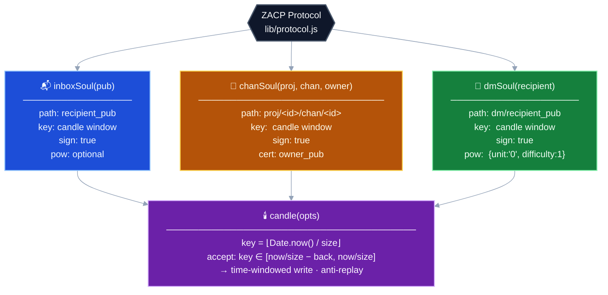
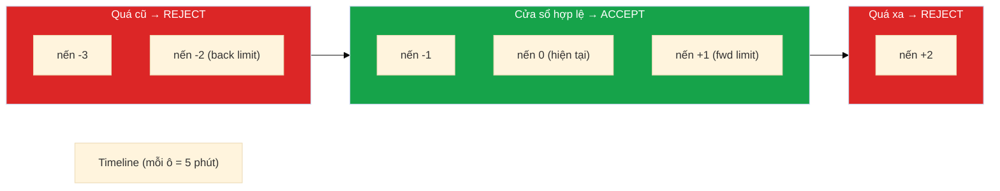

# Lớp 8 — ZACP Integration: Protocol dùng PEN như thế nào

> **Ý tưởng cốt lõi**: ZACP (Zen Application Communication Protocol) là lớp application build trên PEN. Thay vì mỗi developer tự thiết kế policy, ZACP cung cấp 3 soul factory chuẩn hóa cho 3 use case phổ biến nhất.

---

## Ba soul factory của ZACP



---

## Candle Key — Cơ chế thời gian trong key

Đây là concept then chốt của ZACP: **key là một timestamp được rounding về "nến" (candle)**.

```javascript
// Candle size mặc định: 5 phút = 300,000ms
const candleIndex = Math.floor(Date.now() / 300000)
// Ví dụ: Date.now() = 1700000301234 → candleIndex = 5666667

// Writer dùng candleIndex làm key
zen.get(soul).get(candleIndex).put(message)
```

**Predicate trong soul kiểm tra:**
```
key phải nằm trong cửa sổ [now/size - back, now/size + fwd]
```

Ví dụ với `back=2, fwd=1`:
```
Candle hiện tại: 5666667
Cho phép key:   5666665, 5666666, 5666667, 5666668
Reject:         5666664 (quá cũ), 5666669 (quá xa tương lai)
```



**Tại sao cần fwd (future tolerance)?** Clock drift giữa các peer. Alice ở múi giờ khác có thể thấy "current candle" lệch 1 nến so với Bob.

---

## inboxSoul — Hòm thư cá nhân

```javascript
// lib/protocol.js
function inboxSoul(recipientPub, opts) {
  return ZEN.pen({
    path: recipientPub,
    key: candle({ size: 300000, back: 3, fwd: 1 }),
    sign: true,
    ...(opts?.pow && { pow: opts.pow })
  })
}
```

**Ai ghi được:** Bất kỳ ai có private key (signed) + key trong cửa sổ candle.

**Ai đọc được:** Bất kỳ ai (read không bị policy kiểm soát).

**Ý đồ:** Alice public inbox của mình. Bob gửi message vào. Alice đọc. Bot spam → cần thêm `pow` option.

```javascript
// Gửi message vào inbox của Alice
const inbox = inboxSoul(alice_pub)
await zen.get(inbox).get(candleKey()).put({
  from: bob_pub,
  text: "Hey Alice!",
  sig: await ZEN.sign("Hey Alice!", bob_pair)
})
```

---

## chanSoul — Channel nhóm (invite-only)

```javascript
function chanSoul(projectId, channelId, ownerPub) {
  return ZEN.pen({
    path: `${projectId}/${channelId}`,
    key: candle({ size: 300000, back: 3, fwd: 1 }),
    sign: true,
    cert: ownerPub           // phải có cert từ owner
  })
}
```

**Ai ghi được:** Ai có cert được owner cấp + có private key + key trong cửa sổ.

**Flow membership:**
```
1. Admin tạo chanSoul với admin_pub
2. Admin cấp cert cho Bob: cert = ZEN.sign(bob_pub, admin_pair)
3. Bob ghi vào channel kèm cert
4. Peer verify: cert hợp lệ từ admin? → accept
```

---

## dmSoul — Direct Message (anti-spam)

```javascript
function dmSoul(recipientPub) {
  return ZEN.pen({
    path: `dm/${recipientPub}`,
    key: candle({ size: 300000, back: 3, fwd: 1 }),
    sign: true,
    pow: { unit: '0', difficulty: 1 }  // phải mine PoW
  })
}
```

**Ai ghi được:** Ai có private key + đã mine PoW + key trong cửa sổ.

**Tại sao cả sign lẫn pow?**
- `sign`: biết message đến từ ai (accountability)
- `pow`: anti-spam (tốn CPU mỗi message)

```javascript
// Gửi DM cho Alice
const dm = dmSoul(alice_pub)
const key = candleKey()
await zen.get(dm).get(key).put(message, null, { pow: true })
//                                              ↑ bật auto-mine
```

---

## Tổng hợp — So sánh 3 soul

| | inboxSoul | chanSoul | dmSoul |
|--|-----------|----------|--------|
| **Path** | recipient_pub | proj/chan | dm/recipient_pub |
| **Auth** | sign | sign + cert | sign + pow |
| **Ai ghi được** | Bất kỳ ai có key | Member được invite | Bất kỳ ai (tốn CPU) |
| **Chống spam** | Không (thêm pow tùy chọn) | Có (invite-only) | Có (PoW) |
| **Revoke member** | Không được | Không được | — |

---

## Candle — Chi tiết implementation

```javascript
function candle(opts) {
  var size = opts.size || 300000   // 5 phút
  var back = opts.back || 3        // cho phép 3 nến cũ
  var fwd  = opts.fwd  || 1        // cho phép 1 nến tương lai

  return {
    // Được compiler PEN biên dịch thành:
    // SEGRN(R[0]) nằm trong [now/size - back, now/size + fwd]
    and: [
      { gte: [{ seg: [{ reg: 0 }, '_', 1], tonum: true },
              { sub: [{ div: [{ reg: 4 }, size] }, back] }] },
      { lte: [{ seg: [{ reg: 0 }, '_', 1], tonum: true },
              { add: [{ div: [{ reg: 4 }, size] }, fwd] }] }
    ]
  }
}

// Tạo key cho write hiện tại
function candleKey(size) {
  return Math.floor(Date.now() / (size || 300000))
}
```

---

## Xem thêm

- [Lớp 5 — Policy Tail](05_policy-tail.md) — SGN, CRT, PoW được dùng trong 3 soul trên
- [Lớp 6 — PoW](06_pow.md) — dmSoul dùng PoW như thế nào
- [Lớp 7 — Compiler DSL](07_compiler-dsl.md) — ZACP souls được biên dịch bởi ZEN.pen()
- [00 — Overview](00_pen-deepdive.md) — Mental model tổng kết
